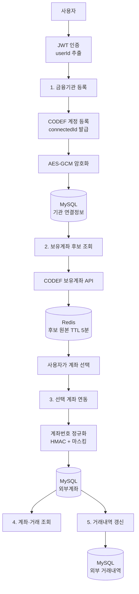
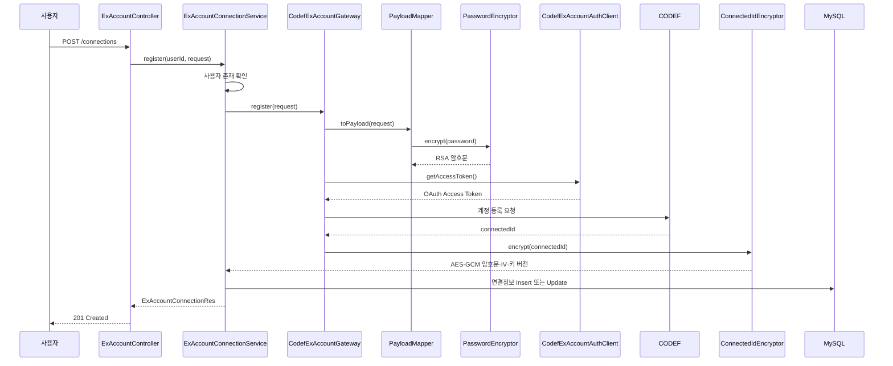
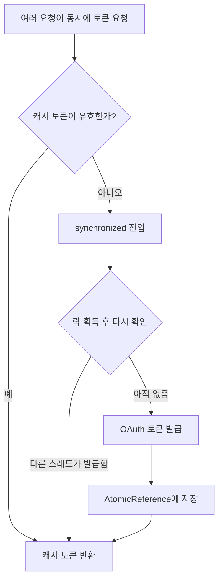
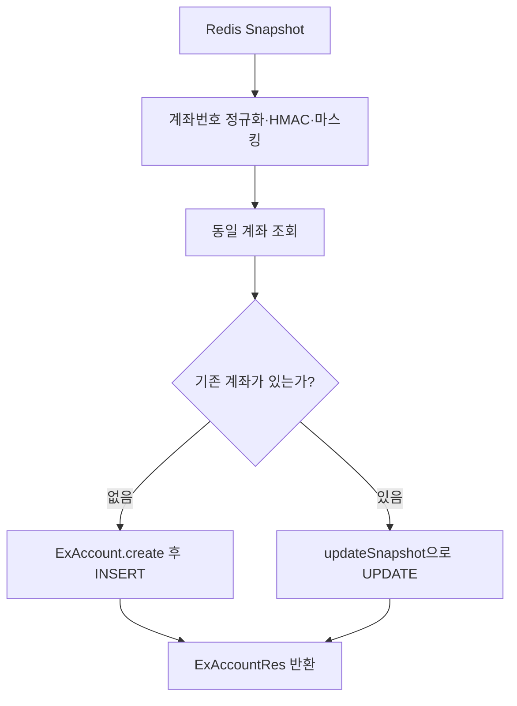
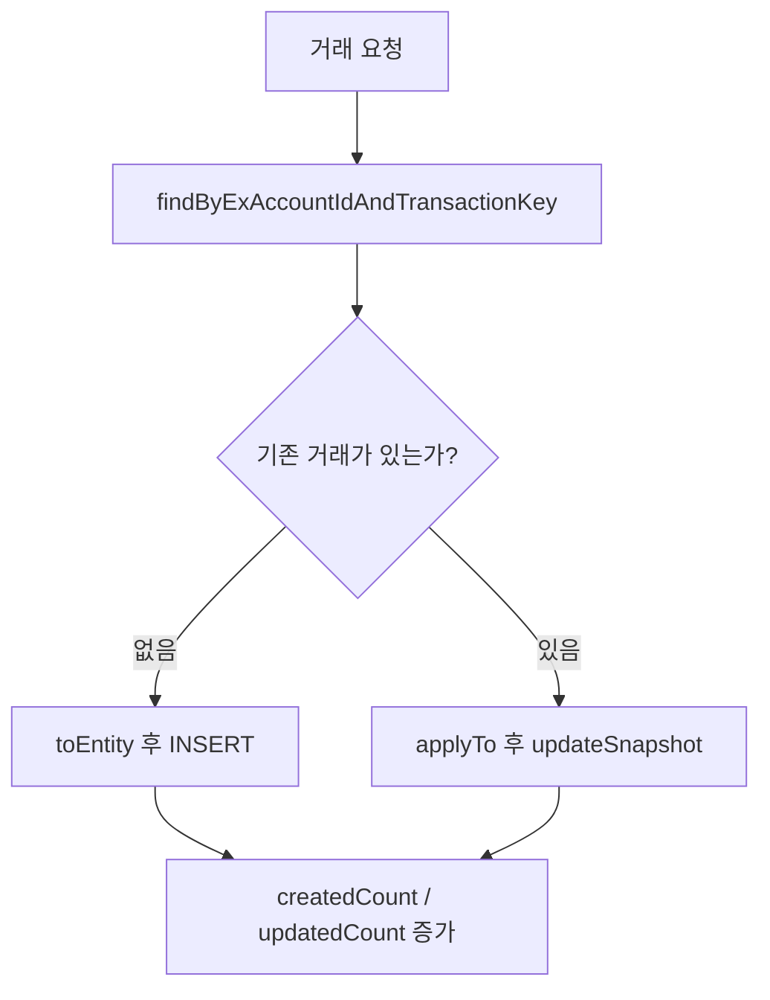
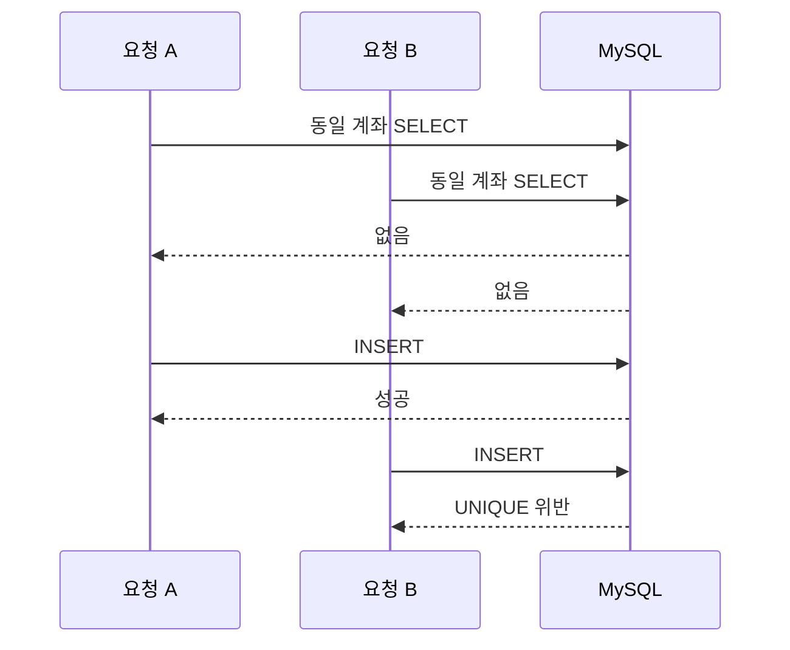
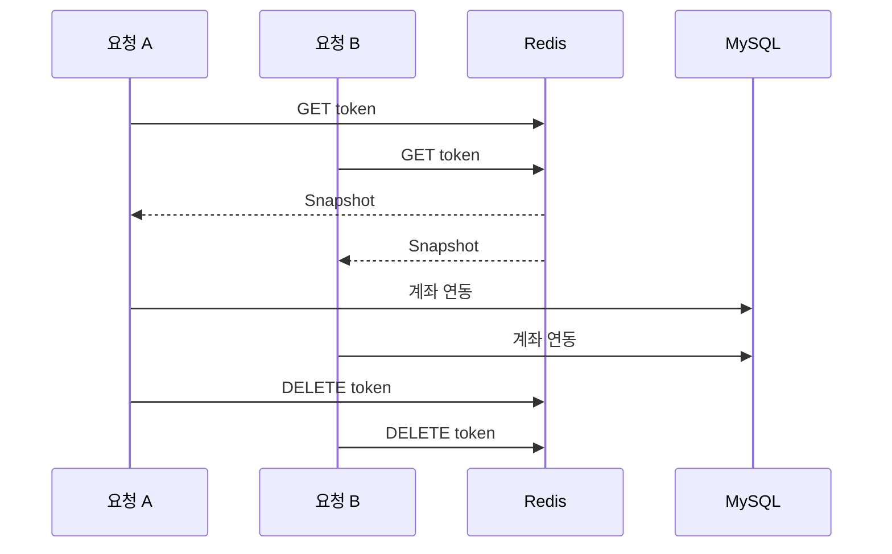

# 외부계좌(exAccount) 연동 기술·CS 보고서

> 사용자 요청부터 CODEF, Redis, MySQL까지 실제 실행 순서로 이해하는 외부계좌 연동 문서

- 기준 코드: `backend/src/main/java/com/team10/backend`
- 주요 주제: JWT 인증, CODEF 연동, RSA, AES-GCM, HMAC-SHA-256, Redis TTL, JPA, 트랜잭션, 동시성
- 작성 기준일: 2026-06-22

---

## 1. 문서 목적

이 문서는 외부계좌 기능에 사용된 기술을 단순히 나열하지 않는다. 사용자가 외부 금융기관을 등록하고 계좌를 연결하는 실제 실행 순서를 따라가면서 다음 내용을 설명한다.

1. 각 API가 어떤 순서로 실행되는가
2. 어떤 파일의 어떤 메서드를 통과하는가
3. CODEF, Redis, MySQL이 각각 어떤 역할을 담당하는가
4. RSA, AES-GCM, HMAC, 마스킹은 무엇이 다른가
5. 트랜잭션과 DB 제약이 어떤 문제를 방지하는가
6. 현재 동시성 처리가 해결한 문제와 남아 있는 한계는 무엇인가

외부계좌 기능은 다음 문장으로 요약할 수 있다.

> 외부 금융기관 인증정보를 CODEF에 등록하고, CODEF에서 받은 계좌 후보를 Redis에 잠시 보관한 뒤, 사용자가 선택한 계좌만 보안 처리하여 MySQL에 영구 저장한다.

---

## 2. 전체 흐름 요약

외부계좌 연결은 다음 순서로 진행된다.

1. JWT 인증을 통해 현재 사용자의 `userId`를 확인한다.
2. 사용자의 은행 인증정보를 CODEF에 등록한다.
3. CODEF에서 받은 `connectedId`를 AES-GCM으로 암호화해 MySQL에 저장한다.
4. 암호화된 `connectedId`를 복호화해 CODEF 보유계좌를 조회한다.
5. 계좌 후보 원본은 Redis에 5분 동안 저장한다.
6. 프론트에는 마스킹된 계좌번호와 일회용 후보 토큰만 전달한다.
7. 사용자가 선택한 계좌를 HMAC과 마스킹 처리해 MySQL에 저장한다.
8. 이후 계좌와 거래내역은 MySQL에서 조회한다.
9. 거래내역 새로고침 요청은 `transactionKey` 기준으로 신규 저장 또는 갱신한다.



### 시스템별 역할

| 시스템 | 쉬운 설명 | 책임 |
|---|---|---|
| 프론트엔드 | 사용자가 보는 화면 | JWT 전달, 기관정보 입력, 계좌 후보 선택 |
| Spring Boot | 업무를 처리하는 서버 | 검증, 보안 처리, CODEF·Redis·DB 흐름 조정 |
| CODEF | 금융기관 연결 중계 시스템 | 기관 계정 등록, 보유계좌 조회 |
| Redis | 자동 만료되는 임시 보관함 | 선택 전 계좌 후보 원본을 5분간 저장 |
| MySQL | 영구 장부 | 기관 연결, 연동 계좌, 거래내역 저장 |

---

## 3. 공통 선행 단계: JWT 인증

외부계좌 API가 Controller에 도달하기 전에 `JwtAuthenticationFilter`가 실행된다.

### 실행 순서

1. `Authorization: Bearer {JWT}` 헤더를 읽는다.
2. JWT 서명과 만료 시간을 검증한다.
3. JWT에서 `userId`와 `jti`를 추출한다.
4. `jti`가 로그아웃 토큰 블랙리스트에 있는지 확인한다.
5. 정상 토큰이면 `SecurityContext`의 principal에 `Long userId`를 저장한다.
6. Controller가 `@AuthenticationPrincipal Long userId`로 값을 받는다.

### 통과하는 파일과 메서드

| 순서 | 파일 | 메서드 | 역할 |
|---:|---|---|---|
| 1 | `global/security/JwtAuthenticationFilter.java` | `doFilterInternal()` | Bearer 토큰 추출, 블랙리스트 확인, 인증 객체 생성 |
| 2 | `global/jwt/JwtProvider.java` | `parseTokenClaims()` | JWT 서명·만료 검증과 `userId`, `jti` 추출 |
| 3 | `domain/exAccount/controller/ExAccountController.java` | 각 API 메서드 | `@AuthenticationPrincipal`로 `userId` 수신 |

### 인증과 인가의 차이

- 인증(Authentication): 요청한 사용자가 누구인지 확인한다.
- 인가(Authorization): 그 사용자가 특정 계좌를 볼 수 있는지 확인한다.

JWT는 인증을 담당한다. 다음과 같이 Repository 조회에 `userId`를 함께 넣는 것은 계좌 소유권 인가 역할을 한다.

```java
accountRepository.findByIdAndUserId(exAccountId, userId)
```

클라이언트가 다른 사용자의 `exAccountId`를 추측해 보내더라도 현재 인증 사용자의 `userId`와 일치하지 않으면 조회되지 않는다. 이는 객체 ID를 바꿔 다른 사용자의 데이터에 접근하는 IDOR 공격을 방지하는 핵심 조건이다.

---

## 4. 1단계: 금융기관 계정 등록

### API

```http
POST /api/v1/external-accounts/connections
```

사용자는 기관코드, 은행 로그인 ID, 비밀번호, 생년월일 등을 전달한다. 이 단계의 목표는 비밀번호를 우리 DB에 저장하는 것이 아니다. CODEF에 금융기관 계정을 등록하고 이후 조회에 사용할 `connectedId`를 발급받는 것이다.

### 전체 호출 순서



### 통과하는 파일과 메서드

| 순서 | 파일 | 메서드 | 역할 |
|---:|---|---|---|
| 1 | `domain/exAccount/controller/ExAccountController.java` | `registerConnection()` | 요청 수신 및 HTTP 201 응답 |
| 2 | `domain/exAccount/service/ExAccountConnectionService.java` | `register()` | 사용자 검증과 전체 등록 흐름 조정 |
| 3 | `domain/codef/exAccount/service/CodefExAccountGateway.java` | `register()` | 내부 도메인과 CODEF 연동 코드의 경계 |
| 4 | `domain/codef/exAccount/mapper/CodefExAccountConnectionPayloadMapper.java` | `toPayload()` | CODEF 계정등록 요청 객체 생성 |
| 5 | `domain/codef/exAccount/crypto/CodefExAccountPasswordEncryptor.java` | `encrypt()` | 은행 비밀번호 RSA 암호화 |
| 6 | `domain/codef/exAccount/client/CodefExAccountAuthClient.java` | `getAccessToken()` | OAuth 토큰 캐시 확인 또는 발급 |
| 7 | `domain/codef/exAccount/client/CodefExAccountClient.java` | `createConnection()` | CODEF 계정등록 HTTP 요청 |
| 8 | `domain/codef/exAccount/client/CodefExAccountResponseDecoder.java` | `decodeConnectionResult()` | 응답 코드 판정과 `connectedId` 추출 |
| 9 | `domain/codef/exAccount/crypto/CodefConnectedIdEncryptor.java` | `encrypt()` | `connectedId` AES-GCM 암호화 |
| 10 | `domain/exAccount/repository/ExAccountConnectionRepository.java` | `findByUserIdAndOrganization()`, `save()` | 기관 연결정보 Upsert |

### 4.1 요청 검증과 사용자 확인

Controller의 `@Valid`가 요청 DTO 제약을 검사한다. Service는 다음 코드로 실제 사용자가 존재하는지 확인한다.

```java
userRepository.findById(userId)
    .orElseThrow(() -> new BusinessException(UserErrorCode.USER_NOT_FOUND));
```

사용자가 없으면 CODEF 호출 전에 실패한다. 외부 API를 불필요하게 호출하지 않고, 존재하지 않는 사용자와 외부 연결정보가 만들어지는 것도 막는다.

### 4.2 은행 비밀번호와 RSA

은행 비밀번호는 CODEF 공개키를 사용하는 RSA 비대칭 암호화로 보호된다.

```text
은행 비밀번호
  → CODEF 공개키로 RSA 암호화
  → 암호문을 CODEF로 전송
  → CODEF가 개인키로 복호화
```

비대칭 암호화에서는 공개키와 개인키가 서로 다르다.

- 공개키: 누구나 암호화에 사용할 수 있다.
- 개인키: 암호문을 복호화할 때 사용한다.
- 백엔드: CODEF 공개키만 사용한다.
- CODEF: 대응하는 개인키를 보유한다.

비밀번호에 해싱이 아니라 암호화를 사용하는 이유는 CODEF가 은행 인증을 위해 실제 값을 복원해야 하기 때문이다. 해시는 원래 값으로 복원할 수 없으므로 이 목적에 맞지 않는다.

### 4.3 CODEF OAuth 토큰 발급

CODEF API는 Bearer Access Token을 요구한다. `CodefExAccountAuthClient.getAccessToken()`은 다음 순서로 토큰을 가져온다.

1. 메모리의 `AtomicReference<TokenCache>`를 읽는다.
2. 토큰이 현재 시각 기준으로 충분히 유효하면 바로 반환한다.
3. 유효하지 않으면 `synchronized(tokenLock)`에 진입한다.
4. 락을 얻은 뒤 다른 스레드가 토큰을 발급했는지 다시 확인한다.
5. 여전히 토큰이 없으면 OAuth `client_credentials` 요청을 보낸다.
6. 발급 결과를 캐시에 저장한다.

이를 Double-checked locking이라고 부른다.



`AtomicReference`는 여러 스레드 사이에서 캐시 값 변경이 보이도록 가시성을 제공한다. `synchronized`는 한 시점에 하나의 스레드만 발급 영역에 들어가도록 한다.

다만 이 처리는 하나의 JVM 안에서만 유효하다. 서버 인스턴스가 여러 대라면 각 인스턴스는 별도의 토큰 캐시와 락을 가진다.

### 4.4 CODEF 응답 판정

`CodefExAccountResponseDecoder.decodeConnectionResult()`는 HTTP 성공 여부만 보지 않고 CODEF의 결과 코드를 해석한다.

| CODEF 응답 | 서버 판정 | 의미 |
|---|---|---|
| `CF-00000`과 정상 `connectedId` | 성공 | 기관 연결정보 저장으로 진행 |
| `CF-03002`와 `continue2Way=true` | 추가 인증 필요 | 2차 인증이 필요함 |
| `CF-94002` 또는 `errorList` 존재 | 인증정보 오류 | 은행 ID·비밀번호 등이 올바르지 않음 |
| 기타 코드 | 시스템 오류 | CODEF 처리 실패 |
| 빈 본문·잘못된 JSON·빈 `connectedId` | 잘못된 응답 | 응답 계약 위반 |

HTTP 200이더라도 내부 결과가 실패일 수 있기 때문에 응답 본문의 업무 코드를 별도로 검사한다.

### 4.5 connectedId와 AES-GCM

`connectedId`는 이후 보유계좌를 조회할 때 다시 사용해야 한다. 복구 불가능한 해시로 저장할 수 없으므로 AES-GCM 대칭키 암호화를 사용한다.

DB에는 다음 값이 저장된다.

| 컬럼 | 내용 |
|---|---|
| `connected_id_ciphertext` | `connectedId` 암호문 |
| `connected_id_iv` | 매번 무작위 생성되는 12바이트 IV |
| `encryption_key_version` | 사용한 암호화 키 버전 |
| `status` | `ACTIVE`, `REAUTH_REQUIRED`, `REVOKED` |

AES-GCM은 다음 두 가지를 함께 제공한다.

- 기밀성: 비밀키 없이는 원문을 읽을 수 없다.
- 무결성: 암호문, IV 또는 인증 정보가 변조되면 검증에 실패한다.

같은 `connectedId`라도 IV가 매번 달라지므로 암호문도 매번 달라진다. 이는 동일한 값의 반복 패턴이 DB에서 노출되는 것을 줄인다.

키 버전은 AAD에도 들어간다.

```text
AAD = codef-connected-id:{keyVersion}
```

이를 통해 암호문이 기대한 키 버전 문맥에서 만들어졌는지 함께 검증한다.

### 4.6 기관 연결정보 Upsert

동일한 `userId + organization` 연결정보가 존재하면 `replaceConnectedId()`로 갱신하고, 없으면 `ExAccountConnection.create()`로 새 엔티티를 만든다.

DB에도 다음 UNIQUE 제약이 있다.

```text
UNIQUE(user_id, organization)
```

애플리케이션 검사와 DB 제약을 함께 두어 같은 사용자가 같은 기관 연결정보를 중복 저장하는 것을 방지한다.

---

## 5. 2단계: 보유계좌 후보 조회

### API

```http
GET /api/v1/external-accounts/connections/{organization}/candidates
```

기관 등록이 끝나면 해당 기관에 실제로 어떤 계좌가 있는지 조회한다. 이 결과는 최종 연동 계좌가 아니라 사용자가 선택할 후보 목록이다.

### 통과하는 파일과 메서드

| 순서 | 파일 | 메서드 | 역할 |
|---:|---|---|---|
| 1 | `domain/exAccount/controller/ExAccountController.java` | `getProviderLinkCandidates()` | `userId`와 기관코드 전달 |
| 2 | `domain/exAccount/service/ExAccountConnectionService.java` | `getLinkCandidates()` | 후보 조회 전체 흐름 조정 |
| 3 | 같은 파일 | `getActiveConnection()` | 기관 연결 존재 여부와 `ACTIVE` 상태 검사 |
| 4 | `domain/codef/exAccount/service/CodefExAccountGateway.java` | `getAccountSnapshots()` | `connectedId` 복호화와 CODEF 조회 |
| 5 | `domain/codef/exAccount/crypto/CodefConnectedIdEncryptor.java` | `decrypt()` | AES-GCM 복호화 및 변조 검증 |
| 6 | `domain/codef/exAccount/client/CodefExAccountClient.java` | `getAccountList()` | CODEF 보유계좌 HTTP 요청 |
| 7 | `domain/codef/exAccount/client/CodefExAccountResponseDecoder.java` | `decodeData()` | 성공 코드와 `data` 검사 |
| 8 | `domain/codef/exAccount/mapper/CodefExAccountSnapshotMapper.java` | `toSnapshots()` | CODEF JSON을 내부 Snapshot으로 변환 |
| 9 | `domain/exAccount/service/ExAccountSyncService.java` | `getAccountNumberHash()`, `getMaskedAccountNumber()` | HMAC과 마스킹 처리 |
| 10 | `domain/codef/exAccount/store/CodefExAccountCandidateStore.java` | `save()` | Redis 저장과 UUID 토큰 생성 |

### 5.1 연결 상태 확인

`getActiveConnection()`은 다음 조건을 확인한다.

1. 현재 사용자의 해당 기관 연결정보가 존재하는가
2. 연결상태가 `ACTIVE`인가

`REAUTH_REQUIRED` 또는 `REVOKED`이면 CODEF 계좌 조회를 진행하지 않는다. 유효하지 않은 연결정보를 계속 사용하는 것을 방지한다.

### 5.2 connectedId 복호화

DB에 저장된 다음 값을 `EncryptedConnectedId`로 조립한다.

- 암호문
- IV
- 키 버전

`CodefConnectedIdEncryptor.decrypt()`는 키 버전을 확인하고 AES-GCM 인증 태그를 검증한다. 암호문이 변조됐거나 다른 키가 사용되면 복호화가 실패한다.

### 5.3 CODEF 보유계좌 호출과 장애 대응

`CodefExAccountClient.getAccountList()`는 CODEF Bearer Token과 `connectedId`를 사용해 보유계좌를 조회한다.

| 정책 | 설정 | 목적 |
|---|---:|---|
| 연결 타임아웃 | 5초 | CODEF 연결이 안 될 때 빠르게 종료 |
| OAuth 읽기 타임아웃 | 5초 | 토큰 발급 대기 상한 설정 |
| API 읽기 타임아웃 | 30초 | 계좌 조회 응답 대기 상한 설정 |
| 재시도 | 최대 2회 | 일시적인 5xx와 네트워크 장애 완화 |

재시도는 성공 가능성이 있는 일시적 장애에만 적용된다. 잘못된 인증정보나 일반적인 4xx 요청 오류를 반복해도 해결될 가능성이 낮으므로 바로 실패 처리한다.

### 5.4 외부 응답을 내부 Snapshot으로 변환

`CodefExAccountSnapshotMapper`는 CODEF의 복잡한 JSON 구조를 내부 `CodefExAccountSnapshot` 목록으로 변환한다.

주요 변환 대상은 다음과 같다.

| CODEF 필드 | 내부 계좌 유형 |
|---|---|
| `resDepositTrust` | 입출금·저축 또는 `UNKNOWN` |
| `resForeignCurrency` | `FX` |
| `resFund` | `FUND` |
| `resLoan` | `LOAN` |
| `resInsurance` | `INSURANCE` |

추가 처리:

- 금액 문자열에서 쉼표를 제거하고 `BigDecimal`로 변환한다.
- 날짜는 `yyyyMMdd` 또는 ISO 날짜 형식으로 파싱한다.
- 계좌번호가 없는 항목은 후보에서 제외한다.
- 출금가능액은 가능한 여러 CODEF 필드명 중 먼저 존재하는 값을 사용한다.

Gateway와 Mapper를 두는 이유는 외부 API의 구조가 도메인 Service 전체로 퍼지는 것을 막기 위해서다. CODEF 응답 형식이 바뀌면 주로 Client·Decoder·Mapper 경계에서 변경을 흡수할 수 있다.

### 5.5 계좌번호 정규화

계좌번호는 기관마다 하이픈이나 공백 표현이 다를 수 있다.

```text
123-456-789
123 456 789
123456789
```

위 세 값은 같은 계좌일 수 있다. `normalizeAccountNumber()`는 공백과 하이픈을 제거한다.

```java
return accountNumber.replace(" ", "").replace("-", "");
```

이처럼 같은 의미의 입력을 하나의 대표 형식으로 만드는 것을 정규화 또는 canonicalization이라고 한다.

### 5.6 HMAC-SHA-256 Blind Index

정규화된 계좌번호는 `HmacSha256Hasher.hash()`로 변환된다.

```text
HMAC-SHA-256(서버 비밀키, 정규화된 계좌번호)
    → 64자리 16진수 문자열
```

이 결과는 Blind Index로 사용된다. 원본 계좌번호를 MySQL에 저장하지 않고도 같은 계좌인지 비교할 수 있다.

```java
findByUserIdAndOrganizationAndAccountNumberHash(
    userId,
    organization,
    accountNumberHash
)
```

#### 일반 SHA-256 대신 HMAC을 사용하는 이유

계좌번호는 무작위로 충분히 긴 비밀번호가 아니다. 공격자가 가능한 계좌번호 형식을 대량으로 만들어 SHA-256을 계산한 뒤 DB 값과 비교할 수 있다.

HMAC은 서버 비밀키를 함께 사용한다. 비밀키를 모르면 공격자가 같은 Blind Index를 계산하기 어렵다.

### 5.7 계좌번호 마스킹

프론트에는 원본 계좌번호 대신 중간 부분을 별표로 가린 값을 전달한다.

```text
원본:   123456789012
마스킹: 12345***9012
```

너무 짧은 계좌번호는 전체를 별표 처리한다. 사용자가 계좌를 구분하는 데 필요한 최소 정보만 보여 주고 전체 번호 노출을 줄인다.

### 5.8 해싱·암호화·마스킹 비교

| 기술 | 복원 가능 | 키 | 적용 데이터 | 목적 |
|---|---:|---:|---|---|
| RSA 암호화 | 개인키로 가능 | 공개키·개인키 | 은행 비밀번호 | CODEF 안전 전달 |
| AES-GCM | 서버 비밀키로 가능 | 대칭키 | `connectedId` | 저장 후 재사용 |
| HMAC-SHA-256 | 불가능 | 서버 비밀키 | 계좌번호 | 원문 없이 동일 계좌 비교 |
| 마스킹 | 복원 수단 아님 | 없음 | 화면용 계좌번호 | 사용자 표시 최소화 |

### 5.9 Redis 후보 세션

CODEF에서 받은 계좌 Snapshot은 바로 MySQL에 저장하지 않는다. 사용자가 아직 어떤 계좌를 연결할지 선택하지 않았기 때문이다.

Redis 저장 구조:

```text
키: codef:candidate:{userId}:{candidateToken}
값: List<CodefExAccountSnapshot>의 JSON 문자열
TTL: 5분
```

예:

```text
codef:candidate:15:7c0db3b5-61e0-4bf9-bef1-9de5800fa812
```

Redis를 사용하는 이유:

- 선택 전 데이터를 MySQL에 영구 저장하지 않는다.
- 원본 계좌 후보의 보관시간을 최소화한다.
- TTL이 지나면 Redis가 자동 삭제한다.
- 오래된 조회 결과로 계좌를 연결하는 것을 막는다.
- Redis 메모리가 사용하지 않는 세션으로 계속 증가하는 것을 줄인다.

키에 `userId`를 포함하므로 다른 사용자가 UUID 토큰을 알아내더라도 자신의 `userId`로는 같은 Redis 키를 조회할 수 없다.

---

## 6. 3단계: 사용자가 선택한 계좌 연동

### API

```http
POST /api/v1/external-accounts/link
```

프론트는 계좌번호 원본을 다시 보내지 않고 다음 값만 보낸다.

```json
{
  "candidateToken": "Redis에서 받은 UUID",
  "selectedIndexes": [0, 2]
}
```

서버가 Redis에 저장한 원본 Snapshot을 기준으로 최종 계좌를 만들기 때문에 클라이언트가 계좌번호나 잔액을 임의로 조작해 보내는 것을 줄일 수 있다.

### 통과하는 파일과 메서드

| 순서 | 파일 | 메서드 | 역할 |
|---:|---|---|---|
| 1 | `domain/exAccount/controller/ExAccountController.java` | `linkAccount()` | 후보 토큰과 선택 인덱스 수신 |
| 2 | `domain/exAccount/service/ExAccountSyncService.java` | `linkAccounts()` | 토큰 검증, 선택 반복, 토큰 삭제 |
| 3 | `domain/codef/exAccount/store/CodefExAccountCandidateStore.java` | `get()` | `userId + token`으로 Redis 조회 |
| 4 | `domain/exAccount/service/ExAccountSyncService.java` | `upsertAccount()` | 계좌 Insert 또는 Update |
| 5 | 같은 파일 | `protectAccountNumber()` | 정규화, HMAC, 마스킹 |
| 6 | `domain/exAccount/repository/ExAccountRepository.java` | `findByUserIdAndOrganizationAndAccountNumberHash()` | 동일 계좌 조회 |
| 7 | `domain/exAccount/entity/ExAccount.java` | `create()` 또는 `updateSnapshot()` | 신규 생성 또는 Snapshot 갱신 |
| 8 | `domain/codef/exAccount/store/CodefExAccountCandidateStore.java` | `remove()` | 성공 후 후보 토큰 삭제 |

### 6.1 토큰 검증

다음 상황에서는 연결을 진행하지 않는다.

- `candidateToken`이 비어 있다.
- Redis TTL이 만료됐다.
- 현재 `userId + token` 조합의 데이터가 없다.
- Redis 데이터가 비어 있다.

이 경우 `EX_ACCOUNT_CANDIDATE_NOT_FOUND`가 발생한다.

### 6.2 인덱스 검증

각 선택 인덱스는 다음 범위에 있어야 한다.

```text
0 <= index < snapshots.size()
```

범위를 벗어나면 `EX_ACCOUNT_CANDIDATE_INVALID_INDEX`가 발생한다. 존재하지 않는 후보를 선택한 것처럼 요청을 조작하는 것을 막는다.

### 6.3 계좌 Upsert

계좌의 동일성 기준은 다음 세 값이다.

```text
userId + organization + accountNumberHash
```



신규 계좌는 다음 정보를 저장한다.

- 사용자
- 금융기관 코드
- 계좌번호 HMAC
- 마스킹 계좌번호
- 계좌명과 별명
- 자산 유형
- 잔액과 출금가능액
- 개설일, 만기일, 최근 거래일
- `ACTIVE` 상태

기존 계좌는 계좌명, 별명, 잔액, 출금가능액, 만기일, 최근 거래일 등을 최신 Snapshot으로 갱신한다.

### 6.4 JPA Dirty Checking

기존 계좌 갱신 경로는 `save()`를 명시적으로 다시 호출하지 않는다.

```java
exAccount.updateSnapshot(...);
return exAccount;
```

트랜잭션 안에서 Repository로 조회한 엔티티는 영속 상태다. JPA는 트랜잭션 커밋 시점에 최초 상태와 현재 상태를 비교하고 변경된 필드가 있으면 `UPDATE` SQL을 실행한다. 이를 Dirty Checking 또는 변경 감지라고 한다.

```text
Entity 조회
  → 필드 변경
  → 트랜잭션 커밋
  → JPA가 변경 감지
  → UPDATE SQL 실행
```

### 6.5 Redis 토큰 삭제

모든 선택 계좌 처리가 완료되면 `candidateStore.remove()`로 토큰을 삭제한다. 일반적인 순차 요청에서는 같은 토큰을 다시 사용할 수 없으므로 일회용 세션처럼 동작한다.

다만 Redis의 `GET`과 `DELETE`가 분리되어 있어 완전히 동시에 들어온 두 요청은 둘 다 `GET`에 성공할 수 있다. 자세한 내용은 동시성 장에서 설명한다.

---

## 7. 4단계: 연동 계좌 및 거래내역 조회

연동이 끝난 뒤에는 CODEF를 실시간 호출하지 않고 MySQL에 저장된 Snapshot을 읽는다.

### 계좌 목록 API

```http
GET /api/v1/external-accounts/accounts
```

| 순서 | 파일 | 메서드 |
|---:|---|---|
| 1 | `ExAccountController.java` | `getAccounts()` |
| 2 | `ExAccountService.java` | `getAccounts()` |
| 3 | `ExAccountRepository.java` | `findAllByUserId()` |
| 4 | `ExAccountRes.java` | `from()` |

### 계좌 상세 API

```http
GET /api/v1/external-accounts/accounts/{exAccountId}
```

| 순서 | 파일 | 메서드 |
|---:|---|---|
| 1 | `ExAccountController.java` | `getAccountDetail()` |
| 2 | `ExAccountService.java` | `getAccountDetail()` |
| 3 | `ExAccountRepository.java` | `findByIdAndUserId()` |
| 4 | `ExAccountTransactionRepository.java` | `findAllByExAccountIdAndExAccountUserIdOrderByTransactedAtDesc()` |
| 5 | `ExAccountDetailRes.java` | `of()` |

계좌 ID뿐 아니라 `userId`도 함께 조회 조건에 넣으므로 다른 사용자의 계좌 상세를 조회할 수 없다.

### 전체 거래내역 API

```http
GET /transactions
```

`ExAccountTransactionController.getTransactions()`가 `ExAccountTransactionService.getTransactions()`를 호출한다. Repository는 현재 사용자의 모든 외부계좌 거래내역을 거래시각 내림차순으로 반환한다.

### DTO를 사용하는 이유

Entity를 그대로 API 응답으로 반환하지 않고 다음 DTO로 변환한다.

- `ExAccountRes`
- `ExAccountDetailRes`
- `ExAccountTransactionRes`

이점:

- DB 구조와 외부 API 계약을 분리한다.
- 지연 로딩 관계가 그대로 직렬화되는 문제를 줄인다.
- 암호화된 `connectedId` 같은 내부 필드 노출을 막는다.
- API에 필요한 필드만 명시적으로 선택할 수 있다.

MySQL 조회는 CODEF 장애의 직접적인 영향을 받지 않고 빠르게 응답할 수 있다. 반면 CODEF를 매번 호출하는 실시간 조회가 아니므로 MySQL Snapshot이 외부기관의 현재 상태와 항상 동일하다고 보장되지는 않는다.

---

## 8. 5단계: 거래내역 새로고침

### API

```http
POST /api/v1/external-accounts/accounts/{exAccountId}/transactions/refresh
```

> 현재 구현에서는 백엔드가 CODEF 거래내역 API를 직접 호출하지 않는다. 클라이언트가 요청 본문으로 전달한 거래내역을 검증하고 저장한다.

### 통과하는 파일과 메서드

| 순서 | 파일 | 메서드 | 역할 |
|---:|---|---|---|
| 1 | `ExAccountController.java` | `refreshTransactions()` | 거래 목록 수신 |
| 2 | `ExAccountTransactionService.java` | `refreshTransactions()` | 검증, Upsert, 통계 생성 |
| 3 | 같은 파일 | `validateTransactions()` | 빈 목록 검사 |
| 4 | 같은 파일 | `validateTransaction()` | 개별 거래 필수값 검사 |
| 5 | `ExAccountRepository.java` | `findByIdAndUserId()` | 계좌 존재와 소유권 확인 |
| 6 | `ExAccountTransactionService.java` | `upsertTransaction()` | 거래 Insert 또는 Update 판단 |
| 7 | `ExAccountTransactionSyncReq.java` | `toEntity()` 또는 `applyTo()` | Entity 생성 또는 기존 거래 갱신 |
| 8 | `ExAccount.java` | `updateLastTransactionAt()` | 최근 거래일 갱신 |
| 9 | `ExAccountService.java` | `getAccountDetail()` | 갱신된 계좌 상세 조회 |

### 8.1 요청 검증

거래 목록은 비어 있을 수 없다. 각 거래에는 다음 값이 필요하다.

- `transactionKey`
- `transactedAt`
- `direction`
- `amount`

DTO의 Bean Validation과 Service의 명시적 검증을 모두 사용한다.

### 8.2 거래 Upsert

거래 동일성 기준은 다음과 같다.

```text
exAccountId + transactionKey
```



DB에도 다음 UNIQUE 제약이 있다.

```text
UNIQUE(external_account_id, transaction_key)
```

서로 다른 계좌는 같은 거래키를 가질 수 있지만, 하나의 계좌에는 같은 거래키가 두 번 저장될 수 없다.

### 8.3 최근 거래일 갱신

수신된 거래 중 가장 큰 `transactedAt`을 찾고 `LocalDate`로 변환해 계좌의 `lastTransactionAt`을 갱신한다.

처리가 끝나면 다음 통계를 반환한다.

- 전체 수신 건수
- 신규 생성 건수
- 기존 거래 갱신 건수
- 갱신 후 계좌 상세와 거래 목록

### 8.4 멱등성과의 관계

동일한 `transactionKey`가 다시 들어오면 기존 거래를 갱신하므로 최종 데이터 중복을 막는 방향으로 동작한다.

다만 완전한 API 멱등성과는 차이가 있다. 동시 요청에서 두 트랜잭션이 모두 기존 거래가 없다고 판단하면 하나는 DB UNIQUE 제약 위반으로 실패할 수 있다. 최종 DB 상태는 중복되지 않지만 모든 요청이 동일한 성공 응답을 받는 것은 아니다.

---

## 9. 트랜잭션과 ACID

다음 변경 메서드에는 `@Transactional`이 적용된다.

- `ExAccountConnectionService.register()`
- `ExAccountConnectionService.getLinkCandidates()`
- `ExAccountSyncService.linkAccounts()`
- `ExAccountTransactionService.refreshTransactions()`

서비스 클래스 기본값은 `@Transactional(readOnly = true)`이고 변경 메서드에서 일반 트랜잭션으로 다시 선언한다.

### ACID

| 속성 | 의미 | 외부계좌 예시 |
|---|---|---|
| Atomicity | 전부 성공하거나 전부 실패 | 선택 계좌 여러 건 저장 중 오류 시 DB 변경 롤백 |
| Consistency | 정해진 규칙과 제약을 유지 | 복합 UNIQUE 제약으로 중복 방지 |
| Isolation | 동시 트랜잭션의 간섭을 관리 | 같은 계좌를 동시에 연동하는 요청 |
| Durability | 커밋 결과를 영구 보존 | MySQL에 계좌와 거래내역 저장 |

### 읽기 전용 트랜잭션

`@Transactional(readOnly = true)`는 해당 서비스가 기본적으로 조회 목적임을 표현한다. JPA가 불필요한 변경 감지를 줄일 수 있고, 코드 작성자에게 해당 메서드가 데이터를 변경하면 안 된다는 의도를 전달한다.

### 외부 API는 DB 트랜잭션의 일부가 아니다

CODEF HTTP 요청은 MySQL 트랜잭션으로 롤백할 수 없다.

가능한 상황:

```text
CODEF 기관 등록 성공
  → connectedId 발급
  → 이후 MySQL 저장 실패
```

이 경우 CODEF에는 연결정보가 있지만 우리 DB에는 없는 상태가 될 수 있다. 외부 시스템과 로컬 DB를 하나의 일반적인 ACID 트랜잭션으로 묶을 수 없기 때문이다.

### Redis와 MySQL도 하나의 트랜잭션이 아니다

`linkAccounts()`는 계좌를 MySQL에서 처리한 뒤 Redis 후보 토큰을 삭제한다. 하지만 Redis는 MySQL 트랜잭션에 참여하지 않는다.

가능한 상황:

1. Redis 삭제 후 MySQL 커밋이 실패하면 DB는 롤백되지만 토큰은 사라질 수 있다.
2. MySQL 커밋 후 Redis 삭제가 실패하면 계좌는 저장됐지만 토큰은 TTL까지 남을 수 있다.

현재 완화 장치는 다음과 같다.

- Redis TTL 5분이 남은 세션을 자동 정리한다.
- MySQL UNIQUE 제약이 재요청으로 인한 데이터 중복을 막는다.

다만 두 저장소를 완전히 하나의 원자적 작업으로 만들지는 않는다.

---

## 10. 동시성 처리

### 10.1 현재 적용된 동시성 장치

| 영역 | 현재 장치 | 보장 범위 | 남아 있는 가능성 |
|---|---|---|---|
| CODEF OAuth 토큰 | `AtomicReference` + `synchronized` | 단일 JVM 중복 발급 억제 | 다중 서버 인스턴스별 발급 |
| 기관 연결 | DB UNIQUE | 중복 행 방지 | 동시 Upsert 중 한 요청 예외 |
| 계좌 연동 | DB UNIQUE | 동일 계좌 중복 방지 | Read-then-Write 경쟁 |
| 거래 저장 | DB UNIQUE | 동일 거래키 중복 방지 | 동시 Insert 예외 |
| 후보 토큰 | 성공 후 삭제 + TTL | 순차적 재사용 차단 | 동시 `GET` 성공 가능 |

### 10.2 해결된 부분: OAuth 토큰 중복 발급

하나의 서버 인스턴스에서 여러 요청이 동시에 들어와도 `synchronized` 영역 때문에 일반적으로 하나의 스레드만 CODEF OAuth 발급을 수행한다.

나머지 스레드는 락을 얻은 뒤 캐시를 다시 확인하고 이미 발급된 토큰을 사용한다. 이를 통해 다음 문제를 줄인다.

- CODEF OAuth 호출 폭증
- 토큰 발급 제한 초과
- 불필요한 네트워크 비용
- 서로 다른 토큰으로 인한 캐시 낭비

### 10.3 Read-then-Write 경쟁 조건

계좌와 거래 Upsert는 먼저 조회하고 없으면 저장하는 방식이다.



DB UNIQUE 제약이 최종 중복 데이터는 막는다. 하지만 두 요청이 모두 정상 성공하지는 않을 수 있다.

현재 exAccount 경로에서는 다음 동시성 장치가 직접 확인되지 않는다.

- `@Lock(PESSIMISTIC_WRITE)` 비관적 락
- `@Version` 낙관적 락
- DB 네이티브 `INSERT ... ON DUPLICATE KEY UPDATE`
- UNIQUE 위반을 잡아 기존 데이터를 재조회하는 충돌 복구

따라서 현재 구조는 데이터 무결성은 방어하지만 동시 요청을 모두 부드러운 성공으로 수렴시키지는 않는다.

### 10.4 Redis 후보 토큰 경쟁 조건

현재 토큰 소비 과정은 다음과 같다.

```text
GET token
  → DB 계좌 처리
  → DELETE token
```

`GET`과 `DELETE`가 하나의 원자적 연산이 아니므로 다음 상황이 가능하다.



순차 요청에서는 토큰이 한 번 사용된 후 삭제되지만, 완전히 동시인 요청에서는 둘 다 Snapshot을 읽을 수 있다. 최종 DB 중복은 UNIQUE 제약이 방어하지만 한 요청은 예외가 발생할 수 있다.

### 10.5 주요 동시성 전략 개념

| 전략 | 개념 | 적합한 상황 |
|---|---|---|
| 낙관적 락 | 충돌이 드물다고 보고 버전값을 비교 | 읽기가 많고 변경 충돌이 적은 데이터 |
| 비관적 락 | 조회 시 DB 행을 잠가 다른 변경을 대기 | 잔액처럼 충돌 비용이 큰 데이터 |
| 분산 락 | Redis 등을 사용해 여러 서버 사이 락 획득 | 다중 서버에서 하나의 작업만 실행해야 할 때 |
| 원자 명령 | 읽기와 삭제를 Redis 서버 측 한 연산으로 수행 | 일회용 토큰 소비 |
| DB Upsert | DB가 충돌 판정과 Insert/Update를 한 문장으로 처리 | 동시 Upsert 경쟁 축소 |
| 멱등키 | 동일 요청을 식별하는 고유 키 저장 | 네트워크 재시도와 중복 요청 처리 |

위 전략은 CS 개념 설명이다. 현재 exAccount 구현에 모두 적용됐다는 뜻은 아니다. 현재 직접 확인되는 것은 단일 JVM OAuth 락, 트랜잭션, Redis TTL, MySQL UNIQUE 제약이다.

---

## 11. 데이터 모델과 불변조건

### 주요 테이블

| 테이블 | 저장 내용 | 핵심 유일성 조건 |
|---|---|---|
| `codef_external_account_connection` | 기관코드, 암호화된 `connectedId`, 상태 | `user_id + organization` |
| `external_account` | HMAC, 마스킹 번호, 계좌명, 잔액, 유형 | `user_id + organization + account_number_hash` |
| `external_asset_transactions` | 거래키, 일시, 방향, 금액, 메모 | `external_account_id + transaction_key` |

### 불변조건

불변조건은 시스템이 항상 유지해야 하는 규칙이다.

이 기능의 핵심 불변조건은 다음과 같다.

1. 한 사용자는 한 기관에 하나의 연결정보만 가진다.
2. 한 사용자는 같은 기관의 같은 계좌를 중복 소유하지 않는다.
3. 한 외부계좌에는 같은 `transactionKey`가 두 번 저장되지 않는다.
4. `external_account`에는 원본 계좌번호를 저장하지 않는다.
5. 다른 사용자의 계좌 ID로 해당 계좌를 조회할 수 없다.
6. `connectedId`는 원문이 아니라 AES-GCM 암호문으로 저장한다.

애플리케이션 코드만으로 불변조건을 지키면 동시성이나 버그로 우회될 수 있다. DB UNIQUE 제약을 마지막 방어선으로 함께 두는 이유다.

---

## 12. 계층형 아키텍처와 설계 패턴

| 계층·패턴 | 역할 | 이 구현에서의 효과 |
|---|---|---|
| Controller | HTTP 요청·응답 | URL, 상태코드, 요청 검증과 업무 로직 분리 |
| Service | 업무 규칙 | 기관 등록, 후보 조회, 계좌 연동 흐름 조정 |
| Gateway | 외부 시스템 경계 | 도메인 코드가 CODEF 구현에 직접 결합되는 것을 줄임 |
| Client | 실제 HTTP 통신 | OAuth, 타임아웃, 재시도, 요청 전송 집중 |
| Decoder | 외부 응답 판정 | CODEF 결과코드와 JSON 오류 처리 집중 |
| Mapper | 외부·내부 형식 변환 | CODEF JSON을 내부 Snapshot으로 격리 |
| Repository | DB 접근 | Service와 JPA 조회 규칙 분리 |
| Store | Redis 접근 | Redis 키, 직렬화, TTL 로직 분리 |
| DTO | API 계약 | Entity와 민감한 내부 필드 노출 방지 |
| Entity | 도메인 상태 | 생성, Snapshot 갱신, 상태 전이 표현 |

### Gateway를 두는 이유

Service가 CODEF URL, JSON 필드, OAuth 헤더를 직접 알게 되면 외부 API 변경이 업무 로직 전체에 영향을 준다.

`CodefExAccountGateway`는 도메인이 원하는 동작을 다음 두 메서드로 표현한다.

```java
register(request)
getAccountSnapshots(organization, encryptedConnectedId)
```

Service는 CODEF의 실제 HTTP 형식을 몰라도 된다. 외부 시스템에 대한 의존 방향을 좁히는 Adapter 또는 Gateway 패턴의 역할이다.

---

## 13. 장애 시나리오

| 상황 | 차단 지점 | 결과 |
|---|---|---|
| JWT 없음·무효 | Security Filter/Config | 인증 필요 API 접근 차단 |
| 로그아웃된 JWT | `TokenBlocklistService` | 인증정보 설정 안 함 |
| 사용자 없음 | `register()` | `USER_NOT_FOUND` |
| 은행 인증정보 오류 | `decodeConnectionResult()` | `CREDENTIAL_INVALID` |
| CODEF 추가인증 필요 | `decodeConnectionResult()` | `ADDITIONAL_AUTH_REQUIRED` |
| CODEF 5xx | `CodefExAccountClient` | 최대 2회 후 실패 |
| CODEF 시간초과 | RestClient timeout | 최대 2회 후 실패 |
| 비활성 기관 연결 | `getActiveConnection()` | 연결 비활성 예외 |
| 후보 없음 | `getLinkCandidates()` | 빈 목록과 빈 토큰 반환 |
| Redis 토큰 만료 | `candidateStore.get()` | 후보 없음 예외 |
| 인덱스 변조 | `linkAccounts()` | 잘못된 인덱스 예외 |
| 다른 사용자 계좌 ID | `findByIdAndUserId()` | 계좌 없음 예외 |
| 빈 거래 목록 | `validateTransactions()` | 잘못된 입력 예외 |
| 거래 필수값 누락 | `validateTransaction()` | 잘못된 입력 예외 |
| 동시 중복 Insert | MySQL UNIQUE | 한 요청이 제약 위반 가능 |

---

## 14. 핵심 CS 용어

| 용어 | 쉬운 설명 |
|---|---|
| 인증 | 요청한 사용자가 누구인지 확인하는 과정 |
| 인가 | 그 사용자가 특정 자원에 접근할 권한이 있는지 확인하는 과정 |
| 정규화 | 표현이 다른 같은 값을 하나의 표준 형식으로 만드는 것 |
| Blind Index | 원문 없이 동일 데이터인지 검색하기 위한 해시값 |
| 직렬화 | Java 객체를 Redis에 저장할 JSON 문자열로 변환하는 것 |
| TTL | Redis 데이터가 자동 삭제될 때까지의 시간 |
| Upsert | 데이터가 없으면 Insert, 있으면 Update하는 처리 |
| Dirty Checking | JPA가 엔티티 변경을 감지해 UPDATE하는 기능 |
| 멱등성 | 같은 요청을 반복해도 최종 결과가 같아지는 성질 |
| 경쟁 조건 | 동시 실행 순서에 따라 결과가 달라지는 문제 |
| 원자성 | 여러 작업이 하나처럼 전부 성공하거나 전부 실패하는 성질 |
| 복합 UNIQUE | 여러 컬럼의 조합을 유일한 값으로 제한하는 DB 제약 |
| 대칭키 암호화 | 암호화와 복호화에 같은 비밀키를 사용하는 방식 |
| 비대칭키 암호화 | 공개키와 개인키를 분리해 사용하는 방식 |
| HMAC | 비밀키와 해시를 결합해 위조와 사전 계산을 어렵게 하는 방식 |
| AAD | 암호화하지 않지만 GCM 무결성 검증에 포함하는 추가 데이터 |
| IV | 같은 평문도 매번 다른 암호문이 나오게 만드는 초기화 값 |

---

## 15. 주요 파일·메서드 색인

| 주제 | 파일 | 핵심 메서드 |
|---|---|---|
| JWT 인증 | `global/security/JwtAuthenticationFilter.java` | `doFilterInternal()` |
| 외부계좌 API | `domain/exAccount/controller/ExAccountController.java` | `registerConnection()`, `getProviderLinkCandidates()`, `linkAccount()` |
| 전체 거래 조회 | `domain/exAccount/controller/ExAccountTransactionController.java` | `getTransactions()` |
| 기관 등록 | `domain/exAccount/service/ExAccountConnectionService.java` | `register()` |
| 후보 조회 | 같은 파일 | `getLinkCandidates()`, `getActiveConnection()` |
| CODEF 경계 | `domain/codef/exAccount/service/CodefExAccountGateway.java` | `register()`, `getAccountSnapshots()` |
| CODEF HTTP | `domain/codef/exAccount/client/CodefExAccountClient.java` | `createConnection()`, `getAccountList()` |
| CODEF OAuth | `domain/codef/exAccount/client/CodefExAccountAuthClient.java` | `getAccessToken()` |
| CODEF 응답 | `domain/codef/exAccount/client/CodefExAccountResponseDecoder.java` | `decodeConnectionResult()`, `decodeData()` |
| 비밀번호 RSA | `domain/codef/exAccount/crypto/CodefExAccountPasswordEncryptor.java` | `encrypt()` |
| connectedId AES | `domain/codef/exAccount/crypto/CodefConnectedIdEncryptor.java` | `encrypt()`, `decrypt()` |
| Snapshot 변환 | `domain/codef/exAccount/mapper/CodefExAccountSnapshotMapper.java` | `toSnapshots()` |
| Redis 후보 | `domain/codef/exAccount/store/CodefExAccountCandidateStore.java` | `save()`, `get()`, `remove()` |
| 계좌 연동 | `domain/exAccount/service/ExAccountSyncService.java` | `linkAccounts()`, `upsertAccount()` |
| HMAC·마스킹 | 같은 파일 | `protectAccountNumber()`, `normalizeAccountNumber()`, `maskAccountNumber()` |
| HMAC 구현 | `global/security/HmacSha256Hasher.java` | `hash()` |
| 계좌 조회 | `domain/exAccount/service/ExAccountService.java` | `getAccounts()`, `getAccountDetail()` |
| 거래 갱신 | `domain/exAccount/service/ExAccountTransactionService.java` | `refreshTransactions()`, `upsertTransaction()` |
| 기관 연결 Entity | `domain/exAccount/entity/ExAccountConnection.java` | `create()`, `replaceConnectedId()`, `encryptedConnectedId()` |
| 계좌 Entity | `domain/exAccount/entity/ExAccount.java` | `create()`, `updateSnapshot()` |
| 거래 Entity | `domain/exAccount/entity/ExAccountTransaction.java` | `create()`, `updateSnapshot()` |

---

## 16. 코드로 확인된 사실과 해석의 경계

### 코드로 직접 확인된 사실

- JWT principal에는 `Long userId`가 저장된다.
- 은행 비밀번호는 CODEF 공개키를 사용해 RSA로 암호화한다.
- `connectedId`는 AES-GCM으로 암호화한다.
- 암호화 결과에는 암호문, IV, 키 버전이 포함된다.
- 계좌번호는 정규화 후 HMAC-SHA-256 Blind Index로 변환한다.
- MySQL에는 계좌번호 원문 대신 HMAC과 마스킹 값이 저장된다.
- 계좌 후보 원본은 Redis에 JSON 문자열로 저장된다.
- Redis 후보 TTL은 5분이다.
- 성공한 계좌 연동 후 후보 토큰을 삭제한다.
- OAuth 토큰 캐시는 `AtomicReference`와 `synchronized`를 사용한다.
- 기관 연결, 계좌, 거래내역에 DB UNIQUE 제약이 있다.
- 거래내역 새로고침 API는 CODEF 거래 API를 직접 호출하지 않는다.
- exAccount Repository에는 명시적인 비관적·낙관적 락이 없다.

### 코드에서 합리적으로 추론되는 내용

- 단일 JVM에서는 OAuth 토큰 중복 발급이 대부분 방지된다.
- 서버가 여러 대면 인스턴스마다 별도 OAuth 토큰을 발급할 수 있다.
- 같은 Redis 후보 토큰의 동시 요청은 둘 다 Snapshot을 읽을 수 있다.
- 동일 계좌의 동시 연동에서 DB 중복은 막히지만 한 요청은 실패할 수 있다.
- Redis와 MySQL 사이에는 하나의 원자적인 분산 트랜잭션이 없다.

### 현재 저장소만으로 확인되지 않는 부분

- 거래내역 새로고침 요청 데이터가 프론트에서 어떻게 생성되는지
- 운영 서버가 단일 인스턴스인지 다중 인스턴스인지
- 운영 Redis가 단일 노드, 복제, Sentinel 또는 Cluster인지
- Redis 영속화와 장애 복구 정책
- CODEF OAuth 토큰의 실제 운영 발급 제한
- DB UNIQUE 충돌이 최종적으로 어떤 HTTP 상태로 변환되는지

---

## 17. 최종 정리

외부계좌 기능은 데이터의 성격에 따라 저장 위치와 보안 기술을 구분한다.

1. 은행 비밀번호는 CODEF 전달을 위해 RSA로 암호화한다.
2. 다시 사용해야 하는 `connectedId`는 AES-GCM으로 암호화한다.
3. 원문 복원이 필요 없는 계좌번호 비교값은 HMAC Blind Index로 만든다.
4. 사용자 화면에는 마스킹된 계좌번호만 제공한다.
5. 선택 전 계좌 후보는 Redis TTL 5분으로 임시 관리한다.
6. 사용자가 선택한 계좌만 MySQL에 영구 저장한다.
7. JPA 트랜잭션과 Dirty Checking이 여러 DB 변경을 관리한다.
8. MySQL UNIQUE 제약이 동시성 상황의 최종 데이터 중복을 막는다.
9. OAuth 토큰 발급은 단일 JVM에서 `AtomicReference`와 `synchronized`로 제어한다.

현재 구조는 데이터 중복 방지와 민감정보 보호에는 명확한 방어선이 있다. 다만 계좌 Upsert의 Read-then-Write 경쟁, Redis `GET`과 `DELETE` 분리, Redis와 MySQL의 서로 다른 트랜잭션 경계, 다중 서버에서의 OAuth 캐시 분리는 남아 있는 동시성·일관성 경계다.

외부계좌 흐름을 가장 짧게 기억하면 다음과 같다.

> 기관 등록은 접근 자격을 만드는 단계이고, 후보 조회는 임시 목록을 만드는 단계이며, 계좌 연동은 사용자 선택을 영구 저장하는 단계다. 거래 갱신은 거래 고유키를 기준으로 저장 상태를 최신화하는 단계다.
