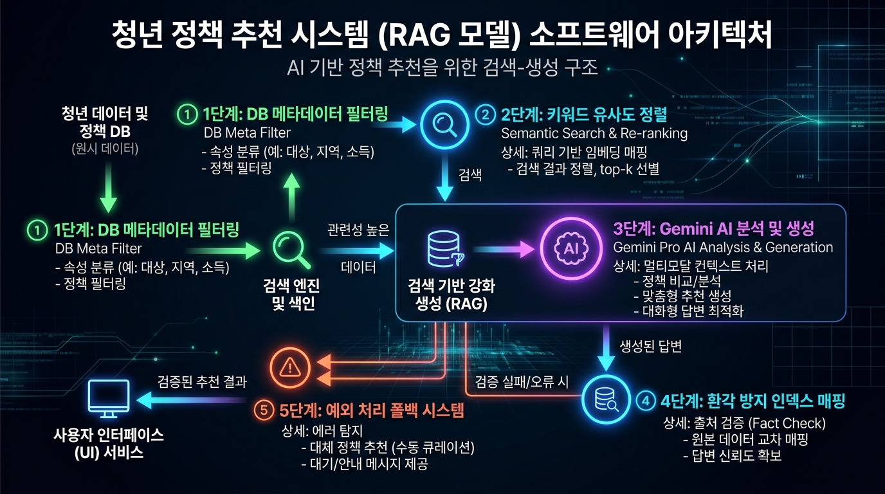
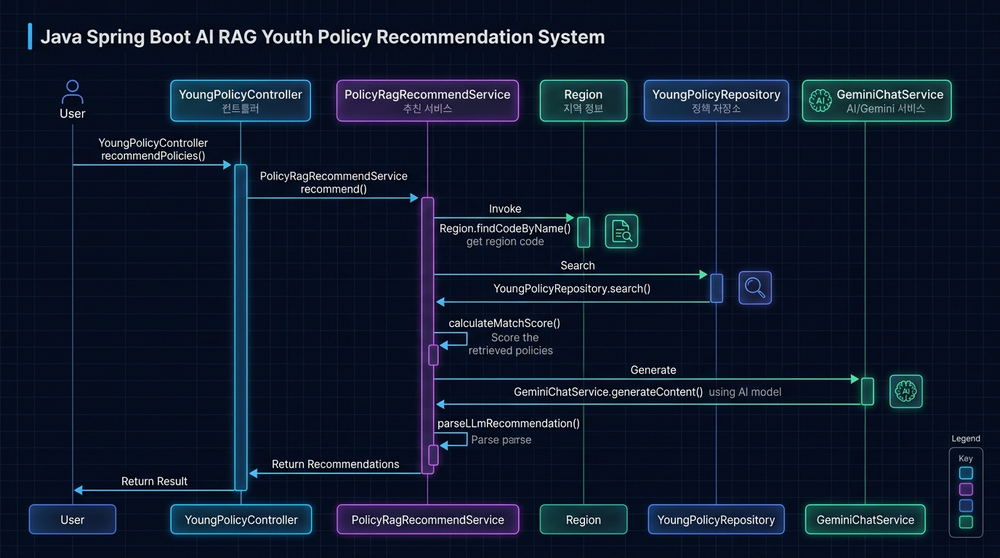

# 💡 한눈에 이해하는 AI 청년정책 추천 시스템 (RAG)

> [!NOTE]
> **RAG(Retrieval-Augmented Generation, 검색 증강 생성)란 무엇인가요?**
> RAG는 AI가 정보를 임의로 지어내어(환각 현상) 추천하지 않도록, **실제 데이터베이스(DB)에서 사용자의 조건에 맞는 정책을 먼저 찾아낸 뒤(Retrieval), 그 데이터를 기반으로 AI가 답변을 작성하도록 돕는 기술**입니다.

---

## 🗺️ 1. 전체 추천 아키텍처 흐름도 (RAG 파이프라인)

사용자가 나이, 거주지역, 관심 카테고리, 고민 내용(질문)을 입력하면 작동하는 아키텍처의 도식화 이미지입니다.



### 🔍 위 아키텍처 이미지 상세 설명 (한글 가이드)
* **청년 데이터 및 정책 DB (원시 데이터)**:
  * **기술 정의**: 청년센터 공식 OpenAPI 연동을 통해 수집한 2,600여 개의 실제 청년 정책 로우 데이터(Raw Data)가 적재되어 있는 MySQL 물리 데이터베이스 저장소입니다.
  * **동작 방식 및 데이터 수집**: 주기적인 배치(Batch) 스케줄링을 통해 공공 데이터 포털 및 청년센터 OpenAPI의 최신 데이터를 수집하여 `young_policy` 테이블에 동기화합니다. 저장 안정성을 확보하고 데이터 잘림 현상을 막기 위해 상세설명 및 지원요건 컬럼은 `TEXT` 계열의 대용량 타입으로 정의되어 있습니다.
  * **설명 및 발표 팁 (Why & Value)**: "RAG 모델의 핵심 전제는 **사실의 원천(Single Source of Truth)**을 구축하는 것입니다. 거대 언어 모델(LLM)이 독자적인 사전 학습 지식에만 의존할 경우, 최신 청년 정책의 변화나 구체적인 지자체 혜택을 알 수 없으며 없는 사실을 진짜처럼 답하는 환각 현상(Hallucination)이 발생합니다. 이를 사전에 완전 차단하기 위해, 신뢰도가 검증된 우리 DB의 청년 정책 데이터를 모든 분석과 추천의 절대적 기준으로 공급합니다."
* **① 1단계: DB 메타데이터 필터링 (DB Meta Filter)**:
  * **기술 정의**: 사용자가 입력한 기본 인구통계학적 조건인 나이와 거주지역을 바탕으로 데이터베이스(SQL) 인덱스 기반의 1차 조건부 필터링을 고속 수행하여 후보군을 압축하는 과정입니다.
  * **동작 방식**: 사용자가 입력한 자연어 주소(예: "서울 마포구")를 `Region` Enum을 활용해 2자리 또는 9자리 행정 코드(예: 서울시 `"11"`)로 실시간 치환합니다. 사용자가 `"전국"`을 입력하면 전국 단위 기관코드 `"003002001"`로 전환합니다. 그 후 QueryDSL을 활용해 `min_age <= 사용자나이 <= max_age` 조건과 `region_code`가 사용자의 지역이거나 중앙정부(코드 `003002001`, `3001` 등)인 대상을 필터링하여 **최대 50개의 정책**을 인출합니다.
  * **설명 및 발표 팁 (Why & Value)**: "2,600여 개의 모든 정책 텍스트를 한꺼번에 AI(Gemini)에 전달하면 엄청난 API 통신 지연(Latency)이 발생하고, 입력 토큰 제한(Token Limit)을 초과해 과도한 비용이 청구됩니다. 따라서 수혜 대상이 될 수 없는 정책들을 SQL 단에서 1차적으로 빠르게 걸러내어, 분석 대상 데이터를 **50개 내외의 유효 풀(Pool)로 고속 압축**해 시스템의 응답 속도와 경제성을 동시에 확보하는 설계입니다."
* **② 2단계: 키워드 유사도 정렬 (Semantic Search & Re-ranking)**:
  * **기술 정의**: 1단계 DB 필터링을 거쳐 추려진 정책 후보군 중, 사용자가 서술형으로 작성한 고민글/질문(`query`)의 맥락에 의미적으로 가장 부합하는 상위 10개 핵심 후보군을 메모리 상에서 선별하는 재정렬(Re-ranking) 알고리즘입니다.
  * **동작 방식**: 사용자의 자연어 입력 텍스트를 공백 단위로 분해하고, 2글자 이상의 의미 있는 검색 키워드(조사 제외)를 도출합니다. 각 후보 정책들의 데이터 필드별로 중요도에 따라 차등 점수를 합산합니다.
    * **정책 제목(Title) 키워드 매치**: 키워드당 **+10.0점** (가장 강력한 일치 지표)
    * **소분류 카테고리(SubCategory) 매치**: 키워드당 **+5.0점**
    * **정책 설명 본문(Description) 매치**: 키워드당 **+2.0점**
  * **설명 및 발표 팁 (Why & Value)**: "별도의 대형 벡터 데이터베이스(Vector DB)나 임베딩 모델(Embedding Model)을 구축 및 유지하는 것은 비용과 서버 부하 측면에서 오버헤드가 클 수 있습니다. 당사 시스템은 **경량화된 가중치 기반 단어 매칭 및 Re-ranking 알고리즘**을 자바 메모리 단에 구축하여, 밀리초(ms) 단위의 랭킹 연산을 실현했습니다. 이렇게 엄선된 상위 10개의 핵심 정보만을 AI의 프롬프트 컨텍스트로 전달함으로써, AI가 덜 중요한 텍스트 소음에 방해받지 않고 정확한 매칭 대상을 최종 심사할 수 있는 정제된 작업 환경을 제공합니다."
* **③ 3단계: Gemini AI 분석 및 생성 (Gemini Pro AI Analysis & Generation)**:
  * **기술 정의**: 2단계에서 엄선된 10개의 최종 후보 리스트를 시스템 지침(System Instruction)과 결합해 Google Gemini 2.5 API로 전송하고, 인공지능이 사용자의 고민에 가장 최적화된 **최종 4개의 추천 정책**을 최종 선별하고 개별 추천 이유를 작문하도록 의뢰하는 과정입니다.
  * **동작 방식**: 백엔드 스프링 서버는 `GeminiChatService`를 호출하여 REST API 통신을 수행합니다. LLM은 사용자의 상세한 사정(예: 취업 준비, 자취 중, 생활비 부족 등)과 10개 후보 정책들의 지원 대상, 혜택, 자격 요건을 다각도로 비교 분석하여 가장 큰 혜택을 줄 수 있는 4개의 정책을 엄선합니다. 각 정책이 왜 이 사용자에게 딱 맞는지를 설명하는 맞춤형 추천 사유(`recommendReason`)를 자연스러운 한글 문장으로 생성하여 사전에 지정된 JSON 형식의 스트링으로 반환합니다.
  * **설명 및 발표 팁 (Why & Value)**: "단순히 검색 점수가 높은 순으로 목록만 던져주는 기존의 기계적 검색엔진과 차별화되는 지점입니다. AI 상담사의 두뇌를 활용하여 사용자의 복합적인 고민 맥락을 해독하고, '왜 이 정책을 신청해야 하는지' 친근하고 논리적인 1대1 개인화 코멘트를 달아줌으로써 사용자에게 깊은 신뢰감을 주는 프리미엄 추천 UX를 구현했습니다."
* **④ 4단계: 환각 방지 인덱스 매핑 (Fact Verification & Index Mapping)**:
  * **기술 정의**: 거대 언어 모델의 최대 취약점인 환각(Hallucination, 잘못된 정보나 신청 주소를 마음대로 생성하는 현상)을 완전히 방지하고 데이터 무결성을 유지하기 위해 도입된 서버 사이드 바인딩 아키텍처입니다.
  * **동작 방식**: AI에게 정책명, 세부 내용, 신청 웹사이트 URL 등의 실물 데이터를 직접 다시 출력하도록 요구하지 않습니다. 대신 시스템 프롬프트를 통해 **"제공된 1~10번 후보 중 골라낸 정책들의 순서 번호(Index, 1~10)와 맞춤 추천 이유만 리턴하라"**고 엄격히 규칙을 제한합니다. AI의 응답을 받으면 자바 서버단에서 해당 인덱스 번호를 기반으로 메모리에 있던 실제 DB 원본 엔티티(신청 URL, 정확한 명칭, 신청 기간 등)를 가져와 매핑(Join)합니다.
  * **설명 및 발표 팁 (Why & Value)**: "AI 모델은 단어 생성 과정에서 글자가 밀리거나 잘못된 URL 하이퍼링크를 지어내는 등의 오류를 매우 빈번히 저지릅니다. 이를 원천 봉쇄하기 위해 데이터 생성의 주도권을 백엔드로 가져왔습니다. AI는 단지 '선정(의사결정)과 맞춤 사유 작문'만 담당하고, 기술적인 실제 정보는 백엔드 메모리에 보관 중이던 원본 객체에서 결합하므로, 사용자가 보게 되는 신청 페이지 연결 주소나 자격 조건 정보는 **100% 무결하고 안전함이 물리적으로 보증**됩니다."
* **⑤ 5단계: 예외 처리 폴백 시스템 (Fallback Safeguard)**:
  * **기술 정의**: 외부 AI 인프라 장장애(네트워크 단절, 트래픽 제한(Quota Limit) 초과, API 타임아웃, 불완전한 JSON 응답 수신 등)가 발생해도, 전체 추천 서비스가 다운되지 않고 무중단 가용성을 유지하도록 설계된 내결함성 방어 메커니즘입니다.
  * **동작 방식**: 추천 메인 프로세스 전반을 `try-catch` 제어권 아래 배치했습니다. API 통신 장애나 결과 파싱 도중 단 한 건의 예외라도 검출되면, 대기 시간 없이 즉시 2단계 Re-ranking 점수가 최고점이었던 **상위 4개 정책 카드를 다이렉트로 선택**합니다. 그리고 기본으로 준비된 공통 추천 사유("사용자의 연령, 지역 조건 및 관심사 분야에 부합하여 추천해 드리는 청년 정책입니다.")를 매핑해 200 OK 응답을 정상 전달합니다.
  * **설명 및 발표 팁 (Why & Value)**: "최첨단 AI 기능을 연동하더라도 인프라 장애로 인해 전체 서비스가 멈춘다면(500 Internal Server Error) 비즈니스 가치가 훼손됩니다. 당사 아키텍처는 **우아한 성능 저하(Graceful Degradation)** 철학을 적용했습니다. 외부 시스템 장애 시 AI 작문 기능만 우회 차단하고, 알고리즘 기반 추천 정보는 차질 없이 제공하여 다운타임을 제로(Zero)화하고 고가용성을 확보했습니다."

---

## 🗺️ 2. 파일 및 메서드 간의 전체 호출 흐름 (Sequence Flow)

사용자가 추천을 요청했을 때, 자바 스프링 부트 백엔드의 파일들과 메서드들이 서로 어떻게 신호를 주고 받는지에 대한 흐름도와 설명입니다.

### 🗺️ 파일/메서드 간 호출 시퀀스 다이어그램


### 🔍 위 시퀀스 다이어그램 이미지 상세 설명 (한글 가이드)
1. **[요청 접수] User ➡️ YoungPolicyController (`recommendPolicies` 메서드)**
   * **과정 (Data Flow)**: 사용자가 프론트엔드 UI 화면에서 나이, 지역(한글 텍스트), 관심 카테고리, 질문(고민글)을 채워 넣고 API(`POST /api/v1/youth-policies/recommend`)를 전송하면, 백엔드의 최전방 진입점인 `YoungPolicyController`가 이 HTTP 요청을 가로칩니다.
   * **수행 내용 (Validation)**: 전송된 JSON 페이로드를 자바 객체인 `YoungPolicyRecommendReq` DTO로 역직렬화합니다. `@Valid` 어노테이션을 구동하여 필수 파라미터 유무, 연령 데이터 범위 등의 기본 규칙 검증을 거친 후, 문제 없을 시 곧바로 핵심 서비스 컴포넌트인 `PolicyRagRecommendService`로 제어권을 이양합니다.
2. **[추천 요청] YoungPolicyController ➡️ PolicyRagRecommendService (`recommend` 메서드)**
   * **과정 (Data Flow)**: 컨트롤러는 주입된 `PolicyRagRecommendService` 빈(Bean)의 `recommend(request)` 메서드를 호출하며 본격적인 RAG 비즈니스 로직을 구동합니다.
   * **수행 내용 (Orchestration)**: 이 메서드는 단순한 연산 처리가 아닌, RAG 파이프라인의 전 주기(지역 코드 변환 ➡️ DB 조회 ➡️ Re-ranking ➡️ Gemini API 호출 ➡️ 결과 검증 및 매핑 ➡️ 장애 캐치 및 폴백 처리)를 순차적으로 조율하고 실행을 감독하는 **중앙 통제사(Orchestrator)** 역할을 담당합니다.
3. **[거주지역 번역] PolicyRagRecommendService ➡️ Region (`findCodeByName` 메서드)**
   * **과정 (Data Flow)**: 사용자가 입력한 자연어 주소 텍스트(예: "서울 특별시 강남구", "경기도 분당구")를 서비스 단에서 처리하기 위해 `Region` Enum 클래스의 `findCodeByName(name)` 메서드를 호출합니다.
   * **수행 내용 (Data Transformation)**: 사용자의 오타나 변형 주소 텍스트 내에서 핵심 도/광역 명칭을 파싱하여 데이터베이스 인덱스가 인식할 수 있는 공식 시도 행정 코드(예: 서울시 `"11"`, 경기도 `"41"`)로 변환합니다. 만약 입력 텍스트에 `"전국"`이 감지되면 중앙정부 정책 검색 전용 코드인 `"003002001"`로 매핑을 유연하게 처리하여 DB 계층의 속도를 돕습니다.
4. **[DB 검색] PolicyRagRecommendService ➡️ YoungPolicyRepository (`search` 메서드)**
   * **과정 (Data Flow)**: 변환된 광역시도 행정 코드와 사용자의 만 나이 파라미터를 담아 QueryDSL 기반의 동적 리포지토리 메서드 `search(filter, pageable)`를 실행합니다.
   * **수행 내용 (DB Filtering)**: 데이터베이스 인덱스 성능을 타고 사용자의 수혜 요건(나이)에 맞고, 사용자의 지역 또는 중앙정부 정책(코드 `003002001` 혹은 `3001` 보유 정책)으로 분류된 DB 레코드를 1차 스캔합니다. 데이터가 잘리지 않도록 `TEXT` 필드로 관리되는 본문 내용을 포함한 최대 50개의 실물 정책 엔티티 리스트(`List<YoungPolicy>`)를 로딩합니다.
5. **[가중치 점수화] PolicyRagRecommendService (자체 메서드 호출 - `calculateMatchScore`)**
   * **과정 (Data Flow)**: DB에서 반환받은 50개의 정책 리스트를 대상으로, 사용자의 서술형 고민글(`query`)과의 단어 매치 빈도를 측정하는 `calculateMatchScore(policy, query)` 연산을 실행합니다.
   * **수행 내용 (Re-ranking)**: 고민글을 띄어쓰기로 분리하여 핵심 단어를 축출하고 각 정책의 중요 영역(제목: 10점, 소분류 카테고리: 5점, 본문 설명: 2점) 매치 시 점수를 차등 누적합니다. 연산 후 총점 기준으로 내림차순 정렬을 수행하며, 가장 유력한 **상위 10개의 최정예 정책 후보군**만 슬라이싱하여 다음 LLM 단계로 넘깁니다.
6. **[AI 생성 요청] PolicyRagRecommendService ➡️ GeminiChatService (`generateContent` 메서드)**
   * **과정 (Data Flow)**: 선별된 10개의 상세 정책 정보와 사용자 고민글, 그리고 JSON 구조 제약 지침이 삽입된 프롬프트를 구성하여 `GeminiChatService` 클래스의 `generateContent(instruction, prompt)` API를 호출합니다.
   * **수행 내용 (HTTP IO & Timeout)**: `RestClientConfig` 설정에 의해 **커넥션 타임아웃 10초, 리드 타임아웃 30초**가 확보된 네트워크 통로를 통해 Google Gemini 2.5 API로 요청을 전송합니다. AI 엔진의 심층 분석과 연산을 기다린 후, 4개의 추천 정책 정보(인덱스 및 사유)가 내포된 깨끗한 구조의 JSON 스트링 응답을 회수합니다.
7. **[객체 파싱 및 결합] PolicyRagRecommendService (자체 메서드 호출 - `parseLlmRecommendation`)**
   * **과정 (Data Flow)**: Gemini AI가 반환한 JSON 스트링을 Jackson `ObjectMapper` 라이브러리를 통해 자바 객체 배열로 역직렬화하고, `parseLlmRecommendation(json, candidates)`를 거쳐 원본 데이터와 물리적 Join을 실행합니다.
   * **수행 내용 (Data Binding & Fallback)**: 역직렬화된 JSON 내의 추천 인덱스(`candidateIndex`) 정보를 이용해 메모리에 적재해 두었던 10개 후보 원본 `YoungPolicy` 객체와 결합합니다. 이를 통해 무결한 정책 정보에 AI가 작문한 맞춤 추천 사유(`recommendReason`)를 병합해 4개의 DTO 카드로 조립하여 클라이언트에게 200 OK 응답으로 최종 리턴합니다. (만약 6~7단계 과정 중 외부 API 통신 실패나 파싱 예외가 나면 즉시 catch 블록으로 건너뛰어 Re-ranking 랭킹 상위 4개 정책을 기반으로 한 Fallback 정책이 실시간 가동됩니다.)

---

## 🏃‍♂️ 3. 3초 요약: 어떻게 추천되나요?

1. **조건 필터링**: 사용자의 나이와 지역에 맞는 정책만 DB에서 1차로 걸러냅니다.
2. **질문 유사도 계산**: 사용자의 질문(고민) 키워드가 많이 들어간 상위 10개 정책을 뽑습니다.
3. **AI 최종 선정**: AI(Gemini)가 10개 후보 중 가장 어울리는 4개를 고르고, 맞춤 추천 사유를 작성합니다.
4. **결과 반환**: 사용자에게 최종 4개의 정책 카드와 맞춤 추천 이유를 반환합니다.

---

## 📌 4. RAG 5단계 핵심 아키텍처 상세 설명 및 코드 파일 매핑

추천 서비스가 가동될 때 내부적으로 수행되는 5단계 핵심 파이프라인의 상세한 동작 원리와 각 단계별 담당 자바 소스코드 파일 및 메서드 안내입니다.

### 1단계: SQL DB 메타데이터 필터링 (SQL DB Metadata Filtering)
* **담당 파일 및 메서드**:
  * [Region.java](file:///Users/apple/devCourse/ExternalAssets/backend/src/main/java/com/team10/backend/domain/youngPolicy/type/Region.java) ➡️ `findCodeByName(String name)`
  * [YoungPolicyRepositoryImpl.java](file:///Users/apple/devCourse/ExternalAssets/backend/src/main/java/com/team10/backend/domain/youngPolicy/repository/YoungPolicyRepositoryImpl.java) ➡️ `search(...)` 및 `regionContains(...)`
* **상세 동작 설명**:
  * 사용자가 입력한 자연어 주소 텍스트(예: "서울 마포구")를 분석하여 `Region` Enum을 활용해 9자리 청년정책 전용 행정코드의 광역 단체 코드(예: 서울시 `"11"`)를 변환 및 도출합니다. 만약 사용자가 `"전국"`을 입력하면 전국 단위 기관코드인 `"003002001"`로 자동 번역됩니다.
  * 변환된 시도 코드와 연령 정보를 바탕으로 DB에서 QueryDSL 기반의 SQL 쿼리를 동적 실행합니다.
  * 나이 조건(`minAge <= 사용자의 만 나이 <= maxAge`)을 만족하고, `regionCode`가 해당 거주지 코드이거나 중앙정부(전국, `3001`, `003002001`) 코드인 대상을 1차 검색합니다. 이 단계는 전체 2,600여 개의 청년정책 중 수혜 가능한 최대 50개의 후보군만 추려냄으로써 성능을 극대화합니다.

### 2단계: 가중치 기반 키워드 유사도 매칭 및 정렬 (Keyword Matching Scoring)
* **담당 파일 및 메서드**:
  * [PolicyRagRecommendService.java](file:///Users/apple/devCourse/ExternalAssets/backend/src/main/java/com/team10/backend/domain/youngPolicy/service/PolicyRagRecommendService.java) ➡️ `calculateMatchScore(YoungPolicy policy, String query)`
* **상세 동작 설명**:
  * 사용자가 기입한 자연어 질문/고민(`query`) 텍스트를 공백 문자 기준으로 쪼개어 조사 등을 제외한 2글자 이상의 핵심 키워드를 선별합니다.
  * 1단계에서 걸러진 최대 50개의 정책 엔티티 각각에 대해 키워드 매칭 점수를 부여하여 내림차순 정렬합니다.
    * **정책명(Title) 매칭**: 키워드당 **10.0점** (가장 확실한 추천 지표)
    * **소분류 분야(SubCategory) 매칭**: 키워드당 **5.0점**
    * **상세 설명(Description) 매칭**: 키워드당 **2.0점**
  * 점수가 가장 높은 **상위 10개 정책**만을 LLM의 질문 컨텍스트용 후보군으로 압축 선정합니다. 이는 AI API 호출 시 입력되는 토큰 수와 비용을 아끼고 연산 속도를 대폭 높여주는 핵심 정렬(Rerank) 알고리즘입니다.

### 3단계: Google Gemini LLM 처리 (Google Gemini LLM Processing)
* **담당 파일 및 메서드**:
  * [PolicyRagRecommendService.java](file:///Users/apple/devCourse/ExternalAssets/backend/src/main/java/com/team10/backend/domain/youngPolicy/service/PolicyRagRecommendService.java) ➡️ `recommend(YoungPolicyRecommendReq request)`
  * [GeminiChatService.java](file:///Users/apple/devCourse/ExternalAssets/backend/src/main/java/com/team10/backend/domain/youngPolicy/service/GeminiChatService.java) ➡️ `generateContent(String systemInstruction, String promptText)`
* **상세 동작 설명**:
  * 2단계에서 엄선된 10개의 후보 정책 목록(제목, 소분류 카테고리, 설명, 나이 기준 등)을 깔끔하게 가공하여 사용자 고민 내용과 결합한 프롬프트로 완성합니다.
  * "전문 청년정책 상담사" 역할을 부여한 시스템 프롬프트지와 완성된 사용자의 요청 프롬프트를 조합하여 Google Gemini 2.5 API로 전송합니다.
  * LLM은 10개 후보 정보 중 사용자 질문에 가장 최적화된 **최종 4개의 정책**을 선정하고, 각 정책을 추천하는 이유(`recommendReason`)를 한국어 1~2문장으로 매끄럽고 신뢰도 있게 작문하여 JSON 어레이 형태로 응답합니다.

### 4단계: 환각 현상(Hallucination) 방지 인덱스 매핑 (Index Mapping)
* **담당 파일 및 메서드**:
  * [PolicyRagRecommendService.java](file:///Users/apple/devCourse/ExternalAssets/backend/src/main/java/com/team10/backend/domain/youngPolicy/service/PolicyRagRecommendService.java) ➡️ `parseLlmRecommendation(String adviceJson, List<YoungPolicy> candidates)`
* **상세 동작 설명**:
  * AI(Gemini)가 없는 정책을 상상해서 지어내거나 신청 링크를 마음대로 변경하여 리턴하는 심각한 오류인 환각 현상(Hallucination)을 막기 위한 안전장치입니다.
  * LLM에게 직접 정책 데이터 텍스트 전체를 재생성하도록 요청하지 않고, 제공했던 1~10번 후보군의 순서 번호인 `candidateIndex`와 그에 대한 맞춤 추천 이유(`reason`)만을 반환받습니다.
  * 자바 서버 단에서 `Jackson ObjectMapper`로 JSON 배열을 파싱한 후, `candidateIndex` 숫자를 통해 실제 10개 후보 리스트(`rerankedCandidates.get(index - 1)`)의 DB 원본 엔티티(실제 DB ID, 진짜 URL, 신청 기간 등)와 직접 매핑(바인딩)합니다. 이 방식을 통해 데이터 신뢰성이 **100% 완벽히 보장**됩니다.

### 5단계: 장애 예외 처리 폴백 시스템 (Graceful Fallback Safeguard)
* **담당 파일 및 메서드**:
  * [PolicyRagRecommendService.java](file:///Users/apple/devCourse/ExternalAssets/backend/src/main/java/com/team10/backend/domain/youngPolicy/service/PolicyRagRecommendService.java) ➡️ `recommend(YoungPolicyRecommendReq request)`의 `catch (Exception e)` 구문
* **상세 동작 설명**:
  * 외부 네트워크 장애, Gemini API 트래픽 한도 초과(Quota Error), 혹은 간헐적으로 AI가 반환한 JSON 스트링이 깨졌을 때 추천 API가 멈추거나 500 에러를 반환하는 등의 시스템 장애를 방어합니다.
  * LLM 처리나 JSON 파싱 중 에러가 발생하는 즉시 대안 로직(Fallback)이 작동합니다.
  * AI 호출 대신, 2단계 유사도 평가에서 가장 높은 순위를 차지한 **상위 4개 정책 카드를 즉시 선택**하고 기본 추천 사유("사용자의 연령, 지역 조건 및 관심사 분야에 부합하여 추천해 드리는 청년 정책입니다.")를 할당해 정상 응답(200 OK)을 전달함으로써 **서비스의 안정성(내결함성)**을 극대화합니다.

---

## 🔎 5. 전국 단위 정책은 어떻게 처리되나요?

* **지방자치단체(예: 서울시) 검색 시**: 해당 지역의 혜택과 더불어 **중앙정부(전국 단위) 정책이 자동으로 합산**되어 추천 후보군으로 공급됩니다.
* **"전국" 검색 시**: 지자체 예산 정책은 제외하고, 대한민국 청년 누구나 신청할 수 있는 **순수 전국 단위 정책만** 필터링됩니다.

---

## 📊 6. 데이터베이스 스키마 및 가중치 정렬 상세

### 1. 청년정책 테이블 (`young_policy`) 스키마
데이터 저장 안정성을 위해 상세 설명 및 기간 조건 등 255자를 초과하는 핵심 필드는 **`TEXT` 대용량 가변 문자 타입**으로 정의되어 있습니다.

| 컬럼명 | 데이터 타입 | 설명 |
| :--- | :--- | :--- |
| `id` | `BIGINT` | 기본 키 (Auto Increment) |
| `policy_id` | `VARCHAR(255)` | 외부 청년센터 정책 ID (Unique) |
| `title` | `VARCHAR(255)` | 정책 명칭 |
| `description` | `TEXT` | 정책 내용 상세 설명 (Rerank 키워드 검색 핵심 대상) |
| `category` | `VARCHAR(255)` | 대분류 카테고리 (예: 금융･복지･문화, 주거지원 등) |
| `sub_category` | `VARCHAR(255)` | 소분류 카테고리 |
| `min_age` | `INT` | 지원 대상 최소 연령 |
| `max_age` | `INT` | 지원 대상 최대 연령 |
| `region_code` | `VARCHAR(255)` | 9자리 행정 구역 코드 (전국 코드는 `003002001`) |
| `apply_period` | `VARCHAR(255)` | 정책 신청 기간 |
| `apply_url` | `TEXT` | 신청 웹사이트 URL |
| `apply_method` | `TEXT` | 신청 방법 안내 |

---

### 2. 가중치 점수 산출 로직 (`calculateMatchScore`)
사용자가 입력한 고민(질문) 텍스트를 분석하여 후보군 10개를 선별하기 위한 메모리 정렬 가중치 코드 구조입니다.

```java
private double calculateMatchScore(YoungPolicy policy, String query) {
    if (query == null || query.isBlank()) {
        return 0.0;
    }

    // 질문 텍스트를 공백 기준으로 쪼개어 키워드 배열로 분리
    String[] keywords = query.split("\\s+");
    double score = 0.0;

    String title = policy.getTitle() != null ? policy.getTitle() : "";
    String desc = policy.getDescription() != null ? policy.getDescription() : "";
    String subCategory = policy.getSubCategory() != null ? policy.getSubCategory() : "";

    for (String kw : keywords) {
        if (kw.length() < 2) continue; // 1글자 단어(조사 등)는 스코어링에서 제외

        // 가중치 매칭 규칙
        if (title.contains(kw)) {
            score += 10.0; // 1. 정책 제목에 키워드가 들어가면 강력한 최우선 후보 (+10.0점)
        }
        if (subCategory.contains(kw)) {
            score += 5.0;  // 2. 소분류 카테고리에 키워드가 들어갈 경우 높은 연관성 (+5.0점)
        }
        if (desc.contains(kw)) {
            score += 2.0;  // 3. 본문 설명 란에 키워드가 들어갈 경우 (+2.0점)
        }
    }
    return score;
}
```

---

## 📂 7. 어디를 보면 되나요? (코드 지도)

추천 시스템을 이루는 핵심 클래스와 담당 역할입니다.

| 파일명 / 경로 | 담당 역할 | 핵심 메서드 및 기능 |
| :--- | :--- | :--- |
| **[YoungPolicyController.java](file:///Users/apple/devCourse/ExternalAssets/backend/src/main/java/com/team10/backend/domain/youngPolicy/controller/YoungPolicyController.java)** | API 요청 수신 | `recommendPolicies`<br>- `/recommend` 엔드포인트 접수 및 파라미터 유효성 검증 |
| **[PolicyRagRecommendService.java](file:///Users/apple/devCourse/ExternalAssets/backend/src/main/java/com/team10/backend/domain/youngPolicy/service/PolicyRagRecommendService.java)** | 추천 알고리즘 통제 | `recommend`<br>- DB 필터링, 키워드 순위 산출, AI 호출 및 파싱 지시<br><br>`calculateMatchScore`<br>- 고민 키워드와 정책 정보 매칭 점수 계산(제목 +10, 설명 +2)<br><br>`parseLlmRecommendation`<br>- AI의 JSON 결과를 자바 객체로 변환 |
| **[GeminiChatService.java](file:///Users/apple/devCourse/ExternalAssets/backend/src/main/java/com/team10/backend/domain/youngPolicy/service/GeminiChatService.java)** | AI 연동 가교 | `generateContent`<br>- Google Gemini AI API와 직접 HTTP 통신 및 텍스트 응답 추출 |
| **[Region.java](file:///Users/apple/devCourse/ExternalAssets/backend/src/main/java/com/team10/backend/domain/youngPolicy/type/Region.java)** | 주소 번역기 | `findCodeByName`<br>- "서울 마포구", "경기 성남시" 등 한글 주소를 DB용 행정 구역 코드로 번역 |
| **[RestClientConfig.java](file:///Users/apple/devCourse/ExternalAssets/backend/src/main/java/com/team10/backend/global/config/RestClientConfig.java)** | 네트워크 설정 | `restClient`<br>- AI 응답이 지연되더라도 끊기지 않도록 **대기 시간을 30초로 연장** 설정 |

---

## 🛡️ 8. 안전하게 동작하기 위한 방어 기법

추천의 품질과 API 연결의 안전성을 보장하기 위해 아래 3가지 방어벽을 세워두었습니다.

* **환각 현상(Hallucination) 100% 방지**:
  * AI가 정책을 임의로 가공하거나 존재하지 않는 링크를 생성하는 것을 막기 위해, AI에게는 **"후보군 10개 중 어울리는 순서 번호(1~10번)만 고르라"**고 지시합니다.
  * 서버에서 AI가 골라준 순서 번호를 받아 실제 원본 DB 정보와 결합하여 전달하므로 데이터 왜곡 가능성이 전혀 없습니다.
* **장애 발생 시 자동 대체 (Fallback)**:
  * Gemini API 키가 누락되었거나, AI 서버 장애 혹은 타임아웃 등으로 응답을 받지 못하더라도 사용자 서비스는 정상 작동합니다.
  * 오류 감지 시 2단계 키워드 매칭 점수가 가장 높은 **상위 4개 정책을 즉시 가동**하고, 기본 추천 사유를 실어서 반환하도록 하여 서버 에러(500)를 완전히 방지합니다.

---

## 📌 9. 이 시스템을 통해 배울 수 있는 핵심 CS 지식

이 시스템을 설계하고 구현하며 활용된 컴퓨터 과학(CS) 분야의 핵심 전공 지식 정리입니다.

### 1. RAG (Retrieval-Augmented Generation, 검색 증강 생성)
* **LLM의 한계**: AI는 학습한 시점의 지식만 알며, 실시간 최신 정보나 우리 서비스의 전용 데이터(지방자치단체 청년정책 등)는 알지 못합니다. 억지로 물어보면 그럴싸한 거짓말을 지어내는 **환각 현상(Hallucination)**이 발생합니다.
* **RAG의 역할**: 시험을 치기 전 관련 참고서를 미리 찾아 공부하고 답을 적는 **오픈북 시험**과 같습니다. 사용자의 질문과 연관된 데이터베이스 정보를 검색하여 AI에게 참고자료로 얹어서 질문을 구성합니다.

### 2. 검색 및 재정렬 알고리즘 (Search & Reranking)
* **메타데이터 필터링**: 지자체별 코드, 수혜 가능한 연령 범위를 DB 인덱싱 기반의 SQL WHERE 절로 1차 필터링하여 대규모 검색 공간을 효과적으로 단축합니다.
* **키워드 매칭 스코어링**: 입력된 자연어 질문을 키워드로 분해한 뒤, 중요 컬럼(정책명은 10점, 설명은 2점 등)과의 중복도를 점수화하여 재정렬하는 가벼운 알고리즘입니다. AI에게 줄 입력 토큰 수 제한을 지키고 높은 완성도의 데이터만 넘기기 위한 **필수 전처리 과정**입니다.

### 3. 네트워크 통신과 대기 시간 (Timeout Management)
* **연결 타임아웃(Connection Timeout)**: 클라이언트와 서버가 길을 트는 시간(TCP Handshake)에 대한 임계치입니다.
* **읽기 타임아웃(Read Timeout)**: 서버가 요청을 받아 추론(생성 작업)을 수행하고 응답 결과 스트림을 완성해 되돌려줄 때까지 대기하는 최대 시간입니다. Gemini LLM 추론은 일반 API 응답(수 밀리초)보다 훨씬 오랜 시간(수 초~수십 초)이 걸리므로 **읽기 대기 타임아웃을 넉넉히(30초) 설정**해야 예외가 나지 않습니다.

### 4. 데이터베이스 필드 구조 설계 (Data Truncation)
* **가변 길이 문자열 vs 큰 문자 객체(LOB)**: 일반 DB 설계에서 `VARCHAR(255)`는 효율적인 데이터 크기를 위해 기본 사용되지만, 긴 설명 데이터가 밀려 들어오면 **데이터 잘림(Data Truncation)** 예외가 나며 저장이 취약해집니다.
* 데이터베이스 설계 관점에서 이를 극복하기 위해 가변 문자 전용 대형 객체(CLOB) 계열인 **`TEXT` 타입**으로 DDL 마이그레이션을 가동하여 저장 안정성을 확보하는 방법을 다룹니다.

### 5. 고가용성과 내결함성 설계 (Fault Tolerance & Fallback)
* **내결함성(Fault Tolerance)**: 외부 타사 서비스(Gemini)에 장애가 생기더라도 우리 시스템 전체가 죽거나 사용자에게 에러 화면을 주면 안 됩니다.
* **우아한 성능 저하(Graceful Degradation)**: AI를 통한 완벽한 개인화 사유 작성이 어렵더라도, 2단계 정렬 점수가 가장 높은 4개의 카드를 선별해 기본 사유와 함께 정상 응답을 리턴하는 대체 경로(Fallback)를 탑재함으로써 **시스템 고가용성**을 확보합니다.
