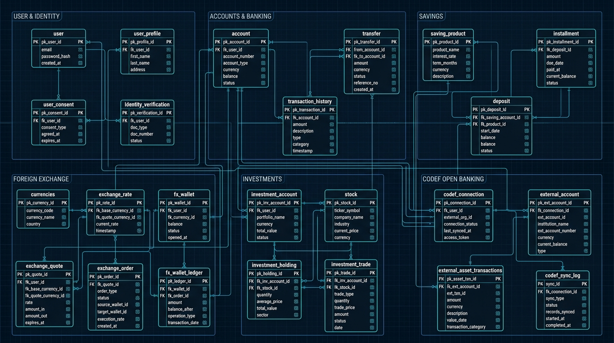

# 🗄️ YouthBank / MoneyStory Database ERD (Entity Relationship Diagram)

This document contains the complete database ERD for the project, covering Auth, Banking, FX (Foreign Exchange), Investment (Stock), and CODEF External Account Integration domains.

---

## 📊 1. Logical Domain ERD (Mermaid)

```mermaid
erDiagram
    %% Auth & User Domain
    USERS ||--|| USER_PROFILES : "profile"
    USERS ||--o{ USER_CONSENTS : "consents"
    USERS ||--o{ IDENTITY_VERIFICATIONS : "identity verifications"
    USER_PROFILES ||--o{ USER_PROFILE_INTERESTS : "interests"

    %% Core Banking Domain
    USERS ||--o{ ACCOUNTS : "holds"
    ACCOUNTS ||--o{ TRANSACTION_HISTORIES : "records"
    ACCOUNTS ||--o{ TRANSFERS : "sent transfers"
    ACCOUNTS ||--o{ TRANSFERS : "received transfers"
    
    %% Savings Products
    USERS ||--o{ DEPOSITS : "signs up"
    USERS ||--o{ INSTALLMENTS : "signs up"
    SAVING_PRODUCT ||--o{ DEPOSITS : "product details"
    SAVING_PRODUCT ||--o{ INSTALLMENTS : "product details"
    ACCOUNTS ||--o{ DEPOSITS : "withdraws principal from"
    ACCOUNTS ||--|| DEPOSITS : "saving account instance"
    ACCOUNTS ||--o{ INSTALLMENTS : "withdraws monthly from"
    ACCOUNTS ||--|| INSTALLMENTS : "saving account instance"

    %% Foreign Exchange (FX) Domain
    CURRENCIES ||--o{ EXCHANGE_RATES : "has rate"
    CURRENCIES ||--o{ FX_WALLETS : "currency"
    CURRENCIES ||--o{ EXCHANGE_QUOTES : "from"
    CURRENCIES ||--o{ EXCHANGE_QUOTES : "to"
    CURRENCIES ||--o{ FX_WALLET_LEDGERS : "ledger currency"
    
    USERS ||--o{ FX_WALLETS : "owns"
    USERS ||--o{ EXCHANGE_QUOTES : "requests"
    USERS ||--o{ EXCHANGE_ORDERS : "orders"
    FX_WALLETS ||--o{ EXCHANGE_ORDERS : "funds foreign"
    ACCOUNTS ||--o{ EXCHANGE_ORDERS : "funds KRW"
    EXCHANGE_QUOTES ||--|| EXCHANGE_ORDERS : "locks rate for"
    EXCHANGE_ORDERS ||--|| TRANSACTION_HISTORIES : "creates KRW txn"
    EXCHANGE_ORDERS ||--o{ FX_WALLET_LEDGERS : "creates ledgers"
    FX_WALLETS ||--o{ FX_WALLET_LEDGERS : "tracks"

    %% CODEF External Assets Domain
    USERS ||--o{ CODEF_EXTERNAL_ACCOUNT_CONNECTION : "external connections"
    USERS ||--o{ EXTERNAL_ACCOUNT : "external accounts"
    EXTERNAL_ACCOUNT ||--o{ EXTERNAL_ASSET_TRANSACTIONS : "external transactions"

    %% Investment (Stock) Domain
    USERS ||--o{ INVESTMENT_ACCOUNTS : "owns"
    USERS ||--o{ STOCK_WATCHLISTS : "watches"
    INVESTMENT_ACCOUNTS ||--o{ INVESTMENT_HOLDINGS : "holds"
    INVESTMENT_ACCOUNTS ||--o{ INVESTMENT_TRADES : "trades"
    STOCKS ||--o{ INVESTMENT_HOLDINGS : "stock info"
    STOCKS ||--o{ INVESTMENT_TRADES : "stock info"
    STOCKS ||--o{ STOCK_WATCHLISTS : "stock info"

    %% System / Idempotency Keys
    USERS ||--o{ IDEMPOTENCY_KEYS : "idempotency logs"

    USERS {
        bigint id PK
        varchar email UK "User Login ID"
        varchar name "Full Name"
        varchar password "BCrypt Hash"
        varchar phone_number "Phone Number"
        date birth_date
        bit identity_verified "Auth Status"
        datetime identity_verified_at "Last verification timestamp"
        enum status "ACTIVE, DORMANT, WITHDRAWN"
        datetime created_at
        datetime updated_at
    }

    USER_PROFILES {
        bigint id PK
        bigint user_id FK, UK
        enum region "SEOUL, BUSAN, etc."
        enum age_group "TEENS, TWENTIES, etc."
        enum occupation_status "EMPLOYED, STUDENT, etc."
        datetime created_at
        datetime updated_at
    }

    USER_PROFILE_INTERESTS {
        bigint profile_id FK
        enum interest "SAVINGS, INVESTMENT, LOAN, etc."
    }

    USER_CONSENTS {
        bigint id PK
        bigint user_id FK
        enum terms_type "SERVICE_TERMS, PERSONAL_INFO, etc."
        bit agreed
        datetime agreed_at
        datetime created_at
        datetime updated_at
    }

    IDENTITY_VERIFICATIONS {
        bigint id PK
        bigint user_id FK
        varchar ocr_name
        varchar ocr_issue_date
        varchar ocr_resident_number
        varchar ocr_resident_number_hash "Blind Index"
        varchar failure_reason
        enum status "OCR_PENDING, GOVERNMENT_VERIFIED, COMPLETED, FAILED, etc."
        datetime created_at
        datetime updated_at
    }

    ACCOUNTS {
        bigint id PK
        bigint user_id FK
        varchar account_number UK
        varchar nickname
        enum account_type "DEPOSIT, SAVING_DEPOSIT, SAVING_INSTALLMENT"
        bigint balance
        varchar account_password_hash
        enum status "ACTIVE, CLOSED, SUSPENDED"
        datetime created_at
        datetime updated_at
    }

    TRANSACTION_HISTORIES {
        bigint id PK
        bigint account_id FK
        bigint transfer_id FK "nullable"
        bigint amount
        bigint balance_before
        bigint balance_after
        enum direction "IN, OUT"
        enum type "DEPOSIT, TRANSFER, PAYMENT, EXCHANGE, etc."
        varchar counterparty_account_number
        varchar counterparty_name
        varchar memo
        datetime transacted_at
        datetime created_at
        datetime updated_at
    }

    TRANSFERS {
        bigint id PK
        bigint sender_account_id FK
        bigint receiver_account_id FK
        bigint amount
        varchar memo
        enum status "SUCCESS, FAILED"
        datetime created_at
        datetime updated_at
    }

    SAVING_PRODUCT {
        bigint id PK
        varchar name "Product Title"
        varchar bank_name "Bank Title"
        varchar bank_code "CODEF Institution Code"
        enum type "DEPOSIT, INSTALLMENT"
        double interest_rate
        int period_month
        bigint min_amount
        bigint max_amount
        bigint monthly_limit
        varchar terms
        bit active
        datetime created_at
        datetime updated_at
    }

    DEPOSITS {
        bigint id PK
        bigint user_id FK
        bigint saving_product_id FK
        bigint withdraw_account_id FK "Principal Source"
        bigint saving_account_id FK, UK "Savings Wallet Account"
        bigint principal "Lump sum amount"
        double interest_rate
        bigint expected_interest
        date maturity_date
        enum status "ACTIVE, CANCELLED, MATURED"
        datetime created_at
        datetime updated_at
    }

    INSTALLMENTS {
        bigint id PK
        bigint user_id FK
        bigint saving_product_id FK
        bigint withdraw_account_id FK "Monthly Source"
        bigint saving_account_id FK, UK "Savings Wallet Account"
        bigint monthly_amount
        bigint target_amount
        bigint paid_amount
        double interest_rate
        date maturity_date
        enum status "ACTIVE, MATURED, CANCELLED, PAYMENT_FAILED"
        bit auto_transfer_yn
        date next_payment_date
        int payment_retry_count
        date next_payment_retry_date
        date last_payment_failed_date
        varchar payment_failure_reason
        datetime created_at
        datetime updated_at
    }

    CURRENCIES {
        bigint id PK
        enum currency_code UK "USD, KRW, JPY, EUR, etc."
        varchar currency_name
        varchar country_name
        int decimal_places
        enum status "ACTIVE, INACTIVE, SUSPENDED"
        datetime created_at
        datetime updated_at
    }

    EXCHANGE_RATES {
        bigint id PK
        enum currency_code FK, UK
        decimal base_price
        int currency_unit
        datetime rate_at
        datetime created_at
        datetime updated_at
    }

    FX_WALLETS {
        bigint id PK
        bigint user_id FK
        enum currency_code FK
        decimal balance
        enum status "ACTIVE, CLOSED, SUSPENDED"
        datetime created_at
        datetime updated_at
    }

    EXCHANGE_QUOTES {
        bigint id PK
        bigint user_id FK
        enum from_currency_code FK
        enum to_currency_code FK
        decimal from_amount
        decimal expected_to_amount
        decimal rate
        decimal fee
        decimal fee_rate
        datetime created_at
        datetime expired_at
        datetime updated_at
    }

    EXCHANGE_ORDERS {
        bigint id PK
        bigint user_id FK
        bigint exchange_quote_id FK, UK
        bigint krw_account_id FK "nullable"
        bigint fx_wallet_id FK "nullable"
        bigint transaction_history_id FK, UK "nullable"
        enum direction "FOREIGN_TO_KRW, KRW_TO_FOREIGN"
        decimal from_amount
        decimal to_amount
        decimal applied_rate
        decimal fee
        decimal fee_rate
        enum status "REQUESTED, COMPLETED, FAILED, CANCELED"
        datetime completed_at
        datetime created_at
        datetime updated_at
    }

    FX_WALLET_LEDGERS {
        bigint id PK
        bigint fx_wallet_id FK
        bigint exchange_order_id FK "nullable"
        enum currency_code FK
        decimal amount
        decimal balance_before
        decimal balance_after
        enum direction "IN, OUT"
        datetime transacted_at
        datetime created_at
        datetime updated_at
    }

    CODEF_EXTERNAL_ACCOUNT_CONNECTION {
        bigint id PK
        bigint user_id FK
        varchar organization "Institution Code"
        varchar connected_id_ciphertext "AES-GCM encrypted CODEF token"
        varchar connected_id_iv "Initialization Vector"
        varchar encryption_key_version
        varchar status "ACTIVE, etc."
        datetime last_synced_at
        datetime created_at
        datetime updated_at
    }

    EXTERNAL_ACCOUNT {
        bigint id PK
        bigint user_id FK
        varchar organization "CODEF Bank Code"
        varchar account_number_hash "Blind HMAC Index"
        varchar account_number_masked "Display mask"
        varchar account_name
        varchar account_alias
        enum asset_type "DEMAND, FUND, SAVING, etc."
        decimal balance
        decimal withdrawable_amount
        date opened_at
        date maturity_at
        date last_transaction_at
        enum status "ACTIVE, CLOSED, UNKNOWN"
        datetime created_at
        datetime updated_at
    }

    EXTERNAL_ASSET_TRANSACTIONS {
        bigint id PK
        bigint external_account_id FK
        varchar transaction_key UK "CODEF transaction hash key"
        enum direction "IN, OUT"
        decimal amount
        decimal balance_after
        varchar counterparty_name
        varchar memo
        varchar raw_category
        datetime transacted_at
        datetime created_at
        datetime updated_at
    }

    INVESTMENT_ACCOUNTS {
        bigint id PK
        bigint user_id FK
        varchar account_number UK
        varchar nickname
        varchar account_password_hash
        bigint cash_balance
        enum currency_code "KRW"
        enum status "ACTIVE, CLOSED, SUSPENDED"
        datetime created_at
        datetime updated_at
    }

    STOCKS {
        bigint id PK
        varchar stock_code UK
        varchar standard_code
        varchar stock_name
        enum market "KOSPI"
        enum currency_code "KRW"
        enum status "ACTIVE, SUSPENDED, DELISTED"
        date listed_date
        bigint capital_amount
        bigint sales_amount
        bigint net_income
        bigint market_cap
        bigint previous_volume
        datetime created_at
        datetime updated_at
    }

    INVESTMENT_HOLDINGS {
        bigint id PK
        bigint investment_account_id FK
        bigint stock_id FK
        bigint quantity
        decimal average_price
        datetime created_at
        datetime updated_at
    }

    INVESTMENT_TRADES {
        bigint id PK
        bigint investment_account_id FK
        bigint stock_id FK
        enum trade_type "BUY, SELL"
        bigint quantity
        bigint execution_price
        bigint total_amount
        bigint requested_price
        int price_deviation_bps
        datetime snapshot_at
        varchar idempotency_key UK
        datetime executed_at
        datetime created_at
        datetime updated_at
    }

    STOCK_WATCHLISTS {
        bigint id PK
        bigint user_id FK
        bigint stock_id FK
        datetime created_at
        datetime updated_at
    }

    MARKET_HOLIDAYS {
        bigint id PK
        date holiday_date
        enum market_type "KRX"
        datetime created_at
        datetime updated_at
    }

    YOUNG_POLICY {
        bigint id PK
        varchar policy_id UK
        varchar title
        text description
        varchar category
        varchar sub_category
        int min_age
        int max_age
        text region_code
        text job_code
        text apply_period
        text apply_url
        text apply_method
        datetime created_at
        datetime updated_at
    }

    IDEMPOTENCY_KEYS {
        bigint id PK
        bigint user_id FK
        varchar idempotency_key
        varchar request_hash
        enum operation_type "EXCHANGE_ORDER, INVESTMENT_MARKET_ORDER, etc."
        text response_body
        int response_status_code
        enum status "PROCESSING, SUCCESS, FAILED, EXPIRED"
        datetime created_at
        datetime updated_at
    }
```

---

## 🏢 2. Domain Categorization

To maintain a clean database schema, the tables are organized into 6 distinct domains:

1. **Identity & User Management**
   * `users` - Core login and identification info.
   * `user_profiles` - Marketing classification metrics (age group, occupation, region).
   * `user_profile_interests` - Multi-select financial areas of interest.
   * `user_consents` - Terms agreements logs (marketing, privacy, etc.).
   * `identity_verifications` - One-Won verification status and OCR scraping info.

2. **Core Banking & Savings Products**
   * `accounts` - Main balance sheets (supporting deposit & savings virtual sub-accounts).
   * `transaction_histories` - Records of all deposits, withdrawals, FX orders, etc.
   * `transfers` - Direct peer-to-peer transfer executions.
   * `saving_product` - Meta definition of deposits/installments products.
   * `deposits` - Users' regular fixed-deposit accounts.
   * `installments` - Users' periodic installment savings (with automated transfer settings).

3. **Foreign Exchange (FX)**
   * `currencies` - Supported currency codes (USD, JPY, EUR, etc.) and decimal scales.
   * `exchange_rates` - Real-time currency conversion rates.
   * `fx_wallets` - Multicurrency balances owned by users.
   * `exchange_quotes` - 5-minute locked-rate exchange pricing requests.
   * `exchange_orders` - Executed exchanges (KRW $\leftrightarrow$ FX) tied to bank accounts and ledgers.
   * `fx_wallet_ledgers` - Double-entry ledger logs for FX wallet changes.

4. **Investments (KOSPI Stocks)**
   * `investment_accounts` - Dedicated stock trading cash wallets.
   * `stocks` - Listed stock items, market caps, and metadata.
   * `investment_holdings` - User-owned stocks and average purchase prices.
   * `investment_trades` - Executed market buy/sell order records.
   * `stock_watchlists` - Users' favorited stocks.
   * `market_holidays` - Holiday calendars for exchange operations.

5. **CODEF Scraped Asset Integration**
   * `codef_external_account_connection` - Secure AES-GCM encrypted tokens linking to external institutions.
   * `external_account` - External account replicas masked for privacy, indexed with blind HMAC indexes.
   * `external_asset_transactions` - Replicated transactions indexed to prevent duplicate syncs.

6. **System Infrastructure**
   * `young_policy` - Crawled public policy data for regional/youth incentives.
   * `idempotency_keys` - Core API guardrails verifying exact client duplicate submissions for financial transactions.
